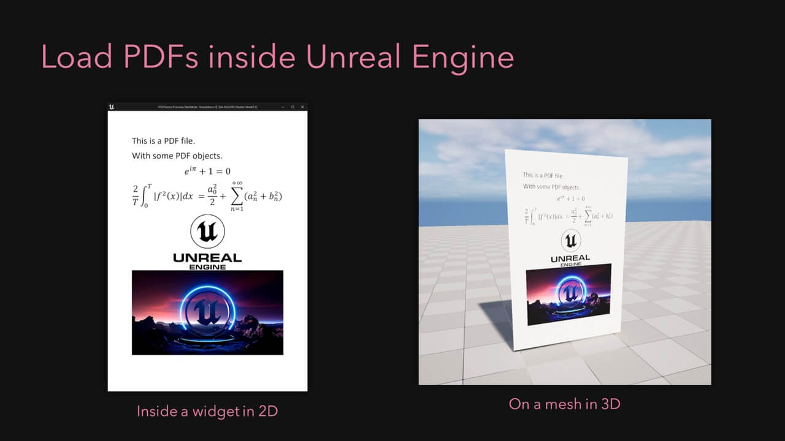

# PDF Viewer

> A Unreal Engine 5 library to load and display PDF files.

Get started by following the guides:
1. [Show a PDF in UMG](/umg)
1. [Show a PDF in the World](/world)

Or explore the API:
1. [Document](/document)
2. [Page](/page)

If you have a problem with the plugin, see the [troubleshooting section](/troubleshoting). 

