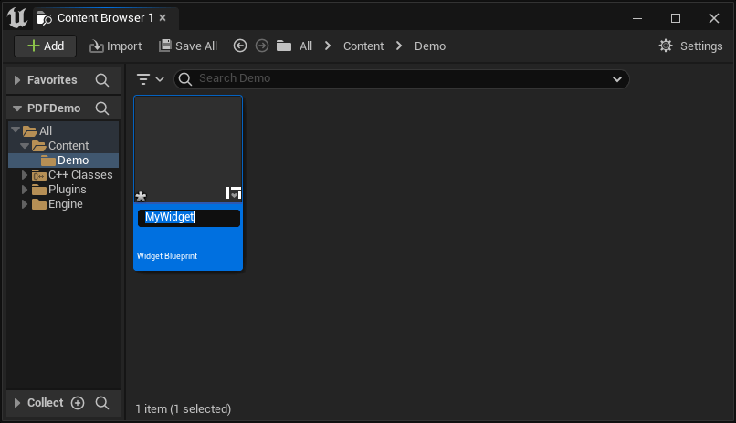
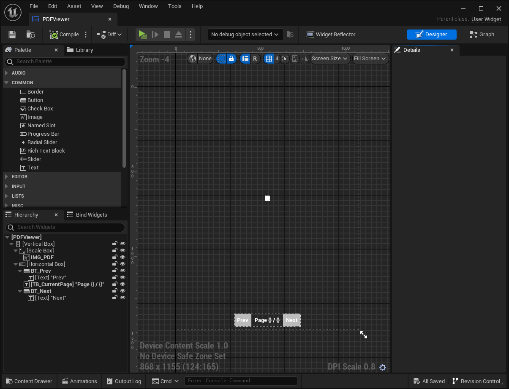
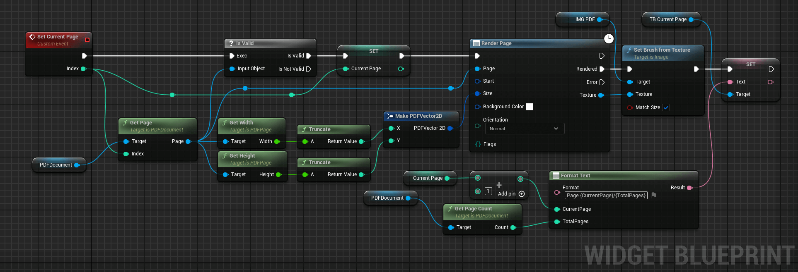
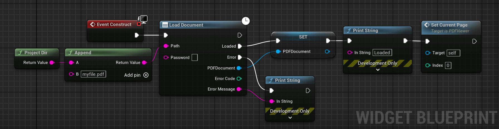
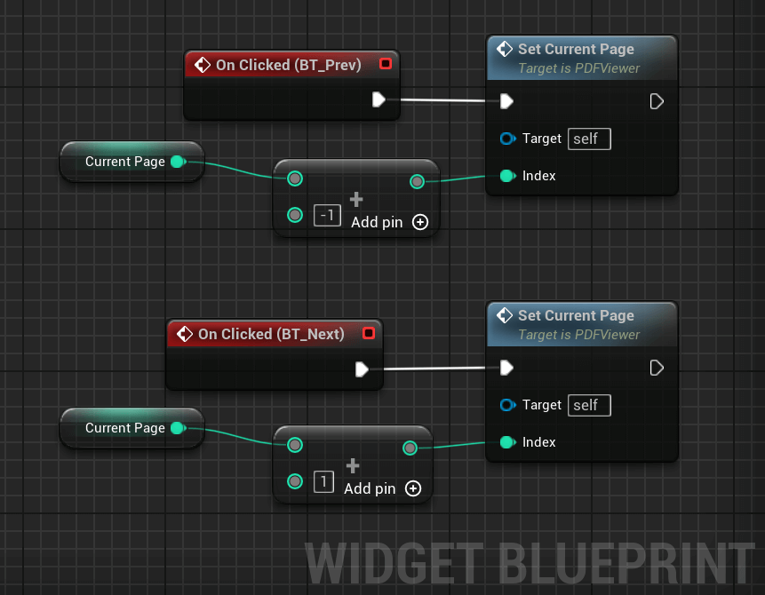
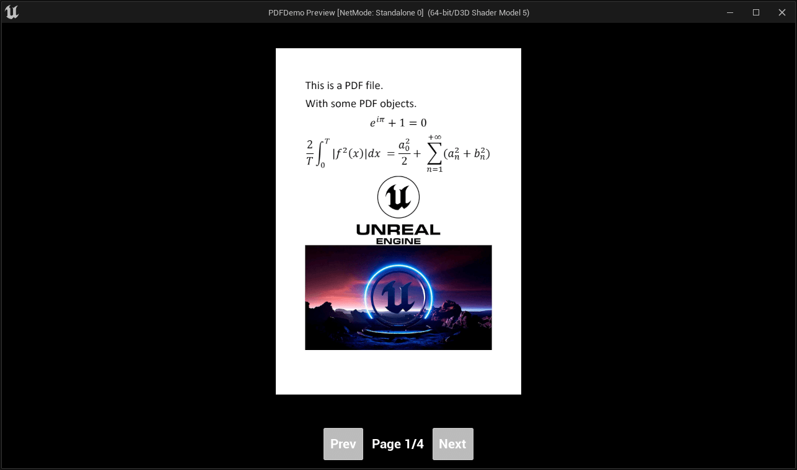

# Create a PDF Viewer (in UMG)

This section shows how to create a PDF viewer in the world.

## **1.** Create the Widget

Start by creating a widget blueprints. Right click in the content browser and select `User Interface` > `Widget Blueprint`.

Give a name to the newly created widget.

## **2.** Setup the Widget

In your widget, add:
1. An image. We will use it to render a page.
2. A button with the text `Prev`. Used to move to the previous page.
3. A button with the text `Next`. Used to move to the next page.
4. A text block. Used to render the current page. i.e. `Page X / Y`.

For a better layout, the image was inserted inside a Scale Box to keep the size of the PDF.

> You can copy the layout for this guide by clicking on `Copy Code` on the image below.

<textarea readonly>
Begin Object Class=/Script/UMG.VerticalBox Name="VerticalBox_75" ExportPath=/Script/UMG.VerticalBox'"/Game/PDFViewer.PDFViewer:WidgetTree.VerticalBox_75"'
   Begin Object Class=/Script/UMG.VerticalBoxSlot Name="VerticalBoxSlot_5" ExportPath=/Script/UMG.VerticalBoxSlot'"/Game/PDFViewer.PDFViewer:WidgetTree.VerticalBox_75.VerticalBoxSlot_5"'
   End Object
   Begin Object Class=/Script/UMG.VerticalBoxSlot Name="VerticalBoxSlot_1" ExportPath=/Script/UMG.VerticalBoxSlot'"/Game/PDFViewer.PDFViewer:WidgetTree.VerticalBox_75.VerticalBoxSlot_1"'
   End Object
   Begin Object Name="VerticalBoxSlot_5" ExportPath=/Script/UMG.VerticalBoxSlot'"/Game/PDFViewer.PDFViewer:WidgetTree.VerticalBox_75.VerticalBoxSlot_5"'
      Size=(SizeRule=Fill)
      HorizontalAlignment=HAlign_Center
      VerticalAlignment=VAlign_Center
      Parent=/Script/UMG.VerticalBox'"VerticalBox_75"'
      Content=/Script/UMG.ScaleBox'"ScaleBox_43"'
   End Object
   Begin Object Name="VerticalBoxSlot_1" ExportPath=/Script/UMG.VerticalBoxSlot'"/Game/PDFViewer.PDFViewer:WidgetTree.VerticalBox_75.VerticalBoxSlot_1"'
      Padding=(Left=20.000000,Top=20.000000,Right=20.000000,Bottom=20.000000)
      HorizontalAlignment=HAlign_Center
      Parent=/Script/UMG.VerticalBox'"VerticalBox_75"'
      Content=/Script/UMG.HorizontalBox'"HorizontalBox_40"'
   End Object
   Slots(0)=/Script/UMG.VerticalBoxSlot'"VerticalBoxSlot_5"'
   Slots(1)=/Script/UMG.VerticalBoxSlot'"VerticalBoxSlot_1"'
   bExpandedInDesigner=True
End Object
Begin Object Class=/Script/UMGEditor.WidgetSlotPair Name="WidgetSlotPair_3" ExportPath=/Script/UMGEditor.WidgetSlotPair'"/Engine/Transient.WidgetSlotPair_3"'
   WidgetName="VerticalBox_75"
End Object
Begin Object Class=/Script/UMG.ScaleBox Name="ScaleBox_43" ExportPath=/Script/UMG.ScaleBox'"/Game/PDFViewer.PDFViewer:WidgetTree.ScaleBox_43"'
   Begin Object Class=/Script/UMG.ScaleBoxSlot Name="ScaleBoxSlot_0" ExportPath=/Script/UMG.ScaleBoxSlot'"/Game/PDFViewer.PDFViewer:WidgetTree.ScaleBox_43.ScaleBoxSlot_0"'
   End Object
   Begin Object Name="ScaleBoxSlot_0" ExportPath=/Script/UMG.ScaleBoxSlot'"/Game/PDFViewer.PDFViewer:WidgetTree.ScaleBox_43.ScaleBoxSlot_0"'
      HorizontalAlignment=HAlign_Fill
      VerticalAlignment=VAlign_Fill
      Parent=/Script/UMG.ScaleBox'"ScaleBox_43"'
      Content=/Script/UMG.Image'"IMG_PDF"'
   End Object
   StretchDirection=DownOnly
   Slots(0)=/Script/UMG.ScaleBoxSlot'"ScaleBoxSlot_0"'
   bExpandedInDesigner=True
End Object
Begin Object Class=/Script/UMG.Image Name="IMG_PDF" ExportPath=/Script/UMG.Image'"/Game/PDFViewer.PDFViewer:WidgetTree.IMG_PDF"'
   DisplayLabel="IMG_PDF"
End Object
Begin Object Class=/Script/UMG.HorizontalBox Name="HorizontalBox_40" ExportPath=/Script/UMG.HorizontalBox'"/Game/PDFViewer.PDFViewer:WidgetTree.HorizontalBox_40"'
   Begin Object Class=/Script/UMG.HorizontalBoxSlot Name="HorizontalBoxSlot_1" ExportPath=/Script/UMG.HorizontalBoxSlot'"/Game/PDFViewer.PDFViewer:WidgetTree.HorizontalBox_40.HorizontalBoxSlot_1"'
   End Object
   Begin Object Class=/Script/UMG.HorizontalBoxSlot Name="HorizontalBoxSlot_0" ExportPath=/Script/UMG.HorizontalBoxSlot'"/Game/PDFViewer.PDFViewer:WidgetTree.HorizontalBox_40.HorizontalBoxSlot_0"'
   End Object
   Begin Object Class=/Script/UMG.HorizontalBoxSlot Name="HorizontalBoxSlot_2" ExportPath=/Script/UMG.HorizontalBoxSlot'"/Game/PDFViewer.PDFViewer:WidgetTree.HorizontalBox_40.HorizontalBoxSlot_2"'
   End Object
   Begin Object Name="HorizontalBoxSlot_1" ExportPath=/Script/UMG.HorizontalBoxSlot'"/Game/PDFViewer.PDFViewer:WidgetTree.HorizontalBox_40.HorizontalBoxSlot_1"'
      Parent=/Script/UMG.HorizontalBox'"HorizontalBox_40"'
      Content=/Script/UMG.Button'"BT_Next"'
   End Object
   Begin Object Name="HorizontalBoxSlot_0" ExportPath=/Script/UMG.HorizontalBoxSlot'"/Game/PDFViewer.PDFViewer:WidgetTree.HorizontalBox_40.HorizontalBoxSlot_0"'
      Parent=/Script/UMG.HorizontalBox'"HorizontalBox_40"'
      Content=/Script/UMG.Button'"BT_Prev"'
   End Object
   Begin Object Name="HorizontalBoxSlot_2" ExportPath=/Script/UMG.HorizontalBoxSlot'"/Game/PDFViewer.PDFViewer:WidgetTree.HorizontalBox_40.HorizontalBoxSlot_2"'
      Padding=(Left=20.000000,Top=20.000000,Right=20.000000,Bottom=20.000000)
      Parent=/Script/UMG.HorizontalBox'"HorizontalBox_40"'
      Content=/Script/UMG.TextBlock'"TB_CurrentPage"'
   End Object
   Slots(0)=/Script/UMG.HorizontalBoxSlot'"HorizontalBoxSlot_0"'
   Slots(1)=/Script/UMG.HorizontalBoxSlot'"HorizontalBoxSlot_2"'
   Slots(2)=/Script/UMG.HorizontalBoxSlot'"HorizontalBoxSlot_1"'
   bExpandedInDesigner=True
End Object
Begin Object Class=/Script/UMG.Button Name="BT_Prev" ExportPath=/Script/UMG.Button'"/Game/PDFViewer.PDFViewer:WidgetTree.BT_Prev"'
   Begin Object Class=/Script/UMG.ButtonSlot Name="ButtonSlot_0" ExportPath=/Script/UMG.ButtonSlot'"/Game/PDFViewer.PDFViewer:WidgetTree.BT_Prev.ButtonSlot_0"'
   End Object
   Begin Object Name="ButtonSlot_0" ExportPath=/Script/UMG.ButtonSlot'"/Game/PDFViewer.PDFViewer:WidgetTree.BT_Prev.ButtonSlot_0"'
      Parent=/Script/UMG.Button'"BT_Prev"'
      Content=/Script/UMG.TextBlock'"TextBlock_123"'
   End Object
   Slots(0)=/Script/UMG.ButtonSlot'"ButtonSlot_0"'
   bExpandedInDesigner=True
   DisplayLabel="BT_Prev"
End Object
Begin Object Class=/Script/UMG.TextBlock Name="TextBlock_123" ExportPath=/Script/UMG.TextBlock'"/Game/PDFViewer.PDFViewer:WidgetTree.TextBlock_123"'
   Text=NSLOCTEXT("[3769F4550C536C266A695884FE45F76D]", "12BC485249611E32CE7D619CF7636619", "Prev")
End Object
Begin Object Class=/Script/UMG.TextBlock Name="TB_CurrentPage" ExportPath=/Script/UMG.TextBlock'"/Game/PDFViewer.PDFViewer:WidgetTree.TB_CurrentPage"'
   Text=NSLOCTEXT("[3769F4550C536C266A695884FE45F76D]", "A403E5594D39D83ECC262B968A5F6EAE", "Page {} / {}")
   bIsVariable=True
   DisplayLabel="TB_CurrentPage"
End Object
Begin Object Class=/Script/UMG.Button Name="BT_Next" ExportPath=/Script/UMG.Button'"/Game/PDFViewer.PDFViewer:WidgetTree.BT_Next"'
   Begin Object Class=/Script/UMG.ButtonSlot Name="ButtonSlot_0" ExportPath=/Script/UMG.ButtonSlot'"/Game/PDFViewer.PDFViewer:WidgetTree.BT_Next.ButtonSlot_0"'
   End Object
   Begin Object Name="ButtonSlot_0" ExportPath=/Script/UMG.ButtonSlot'"/Game/PDFViewer.PDFViewer:WidgetTree.BT_Next.ButtonSlot_0"'
      Parent=/Script/UMG.Button'"BT_Next"'
      Content=/Script/UMG.TextBlock'"TextBlock_176"'
   End Object
   Slots(0)=/Script/UMG.ButtonSlot'"ButtonSlot_0"'
   bExpandedInDesigner=True
   DisplayLabel="BT_Next"
End Object
Begin Object Class=/Script/UMG.TextBlock Name="TextBlock_176" ExportPath=/Script/UMG.TextBlock'"/Game/PDFViewer.PDFViewer:WidgetTree.TextBlock_176"'
   Text=NSLOCTEXT("[3769F4550C536C266A695884FE45F76D]", "89B80279482DF85FF5D63A997989387B", "Next")
End Object
</textarea>

<button onclick="copyBlueprintCode(this)">Copy Code</button>

## **3.** Add the Code

### **3.1.** Setup the variables

Add two new variables:
1. `PDFDocument` of type `UPDFDocument`: contains the loaded PDF Document object.
2. `CurrentPage` of type `int32`: contains the current page index.

### **3.2** Add the code to show a page

We need a function to show a specific page. We start by creating a new function to show a page from an index.

The function does the following:
1. It tries to get the page at the specified index. If the page is invalid, it means the page at the specified index doesn't exist.
2. It updates the current page index variable to keep track of page currently shown.
3. It renders the current page to a texture.
4. It sets the brush of the image to the texture of the current page, displaying the current page in the image.
5. It updates the page label for the current page. We add **1** to the page index to show **1** instead of **0** for the current page.

<textarea readonly>
Begin Object Class=/Script/BlueprintGraph.K2Node_CustomEvent Name="K2Node_CustomEvent_0" ExportPath=/Script/BlueprintGraph.K2Node_CustomEvent'"/Game/PDFViewer.PDFViewer:EventGraph.K2Node_CustomEvent_0"'
   CustomFunctionName="Set Current Page"
   NodePosX=-160
   NodePosY=-560
   NodeGuid=BE6724F14821DBDE72168FA82A6994AD
   CustomProperties Pin (PinId=2EF44863481D3A3746603BACFD5080DE,PinName="OutputDelegate",Direction="EGPD_Output",PinType.PinCategory="delegate",PinType.PinSubCategory="",PinType.PinSubCategoryObject=None,PinType.PinSubCategoryMemberReference=(MemberParent=/Script/UMG.WidgetBlueprintGeneratedClass'"/Game/PDFViewer.PDFViewer_C"',MemberName="Set Current Page",MemberGuid=BE6724F14821DBDE72168FA82A6994AD),PinType.PinValueType=(),PinType.ContainerType=None,PinType.bIsReference=False,PinType.bIsConst=False,PinType.bIsWeakPointer=False,PinType.bIsUObjectWrapper=False,PinType.bSerializeAsSinglePrecisionFloat=False,PersistentGuid=00000000000000000000000000000000,bHidden=False,bNotConnectable=False,bDefaultValueIsReadOnly=False,bDefaultValueIsIgnored=False,bAdvancedView=False,bOrphanedPin=False,)
   CustomProperties Pin (PinId=8DAA3C3D4F1D0DFCA818A79D2CB571B5,PinName="then",Direction="EGPD_Output",PinType.PinCategory="exec",PinType.PinSubCategory="",PinType.PinSubCategoryObject=None,PinType.PinSubCategoryMemberReference=(),PinType.PinValueType=(),PinType.ContainerType=None,PinType.bIsReference=False,PinType.bIsConst=False,PinType.bIsWeakPointer=False,PinType.bIsUObjectWrapper=False,PinType.bSerializeAsSinglePrecisionFloat=False,LinkedTo=(K2Node_MacroInstance_0 9ED8031D49C534579A5D33B398362477,),PersistentGuid=00000000000000000000000000000000,bHidden=False,bNotConnectable=False,bDefaultValueIsReadOnly=False,bDefaultValueIsIgnored=False,bAdvancedView=False,bOrphanedPin=False,)
   CustomProperties Pin (PinId=3D30F7AC44AB15883BD77B8E8406FDE6,PinName="Index",Direction="EGPD_Output",PinType.PinCategory="int",PinType.PinSubCategory="",PinType.PinSubCategoryObject=None,PinType.PinSubCategoryMemberReference=(),PinType.PinValueType=(),PinType.ContainerType=None,PinType.bIsReference=False,PinType.bIsConst=False,PinType.bIsWeakPointer=False,PinType.bIsUObjectWrapper=False,PinType.bSerializeAsSinglePrecisionFloat=False,LinkedTo=(K2Node_CallFunction_3 3C7B18974710FAE7E2AA7784634E24E9,K2Node_Knot_1 7206A57443077F158F6398AFCEDB6C2B,),PersistentGuid=00000000000000000000000000000000,bHidden=False,bNotConnectable=False,bDefaultValueIsReadOnly=False,bDefaultValueIsIgnored=False,bAdvancedView=False,bOrphanedPin=False,)
   CustomProperties UserDefinedPin (PinName="Index",PinType=(PinCategory="int"),DesiredPinDirection=EGPD_Output)
End Object
Begin Object Class=/Script/BlueprintGraph.K2Node_VariableGet Name="K2Node_VariableGet_1" ExportPath=/Script/BlueprintGraph.K2Node_VariableGet'"/Game/PDFViewer.PDFViewer:EventGraph.K2Node_VariableGet_1"'
   VariableReference=(MemberName="PDFDocument",MemberGuid=C256FD65434255DB0C173CA1F1252522,bSelfContext=True)
   NodePosX=-144
   NodePosY=-256
   NodeGuid=240556F443263C7A7E4662B16A5DC80E
   CustomProperties Pin (PinId=507FEF474FA36351671C3F88B47B902B,PinName="PDFDocument",Direction="EGPD_Output",PinType.PinCategory="object",PinType.PinSubCategory="",PinType.PinSubCategoryObject=/Script/CoreUObject.Class'"/Script/PDFViewer.PDFDocument"',PinType.PinSubCategoryMemberReference=(),PinType.PinValueType=(),PinType.ContainerType=None,PinType.bIsReference=False,PinType.bIsConst=False,PinType.bIsWeakPointer=False,PinType.bIsUObjectWrapper=False,PinType.bSerializeAsSinglePrecisionFloat=False,LinkedTo=(K2Node_CallFunction_3 DC275D004ABEF65DEFB22085D49B7FA9,),PersistentGuid=00000000000000000000000000000000,bHidden=False,bNotConnectable=False,bDefaultValueIsReadOnly=False,bDefaultValueIsIgnored=False,bAdvancedView=False,bOrphanedPin=False,)
   CustomProperties Pin (PinId=F83D0980465FFC1EAD3126A9A92434C1,PinName="self",PinFriendlyName=NSLOCTEXT("K2Node", "Target", "Target"),PinType.PinCategory="object",PinType.PinSubCategory="",PinType.PinSubCategoryObject=/Script/UMG.WidgetBlueprintGeneratedClass'"/Game/PDFViewer.PDFViewer_C"',PinType.PinSubCategoryMemberReference=(),PinType.PinValueType=(),PinType.ContainerType=None,PinType.bIsReference=False,PinType.bIsConst=False,PinType.bIsWeakPointer=False,PinType.bIsUObjectWrapper=False,PinType.bSerializeAsSinglePrecisionFloat=False,PersistentGuid=00000000000000000000000000000000,bHidden=True,bNotConnectable=False,bDefaultValueIsReadOnly=False,bDefaultValueIsIgnored=False,bAdvancedView=False,bOrphanedPin=False,)
End Object
Begin Object Class=/Script/BlueprintGraph.K2Node_CallFunction Name="K2Node_CallFunction_3" ExportPath=/Script/BlueprintGraph.K2Node_CallFunction'"/Game/PDFViewer.PDFViewer:EventGraph.K2Node_CallFunction_3"'
   bIsPureFunc=True
   FunctionReference=(MemberParent=/Script/CoreUObject.Class'"/Script/PDFViewer.PDFDocument"',MemberName="GetPage")
   NodePosX=64
   NodePosY=-352
   NodeGuid=BC52E9A247B20DEC444B7EAA70357C47
   CustomProperties Pin (PinId=DC275D004ABEF65DEFB22085D49B7FA9,PinName="self",PinFriendlyName=NSLOCTEXT("K2Node", "Target", "Target"),PinToolTip="Target\nPDFDocument Object Reference",PinType.PinCategory="object",PinType.PinSubCategory="",PinType.PinSubCategoryObject=/Script/CoreUObject.Class'"/Script/PDFViewer.PDFDocument"',PinType.PinSubCategoryMemberReference=(),PinType.PinValueType=(),PinType.ContainerType=None,PinType.bIsReference=False,PinType.bIsConst=False,PinType.bIsWeakPointer=False,PinType.bIsUObjectWrapper=False,PinType.bSerializeAsSinglePrecisionFloat=False,LinkedTo=(K2Node_VariableGet_1 507FEF474FA36351671C3F88B47B902B,),PersistentGuid=00000000000000000000000000000000,bHidden=False,bNotConnectable=False,bDefaultValueIsReadOnly=False,bDefaultValueIsIgnored=False,bAdvancedView=False,bOrphanedPin=False,)
   CustomProperties Pin (PinId=3C7B18974710FAE7E2AA7784634E24E9,PinName="Index",PinToolTip="Index\nInteger\n\nThe index of the page we want.",PinType.PinCategory="int",PinType.PinSubCategory="",PinType.PinSubCategoryObject=None,PinType.PinSubCategoryMemberReference=(),PinType.PinValueType=(),PinType.ContainerType=None,PinType.bIsReference=False,PinType.bIsConst=True,PinType.bIsWeakPointer=False,PinType.bIsUObjectWrapper=False,PinType.bSerializeAsSinglePrecisionFloat=False,DefaultValue="0",AutogeneratedDefaultValue="0",LinkedTo=(K2Node_CustomEvent_0 3D30F7AC44AB15883BD77B8E8406FDE6,),PersistentGuid=00000000000000000000000000000000,bHidden=False,bNotConnectable=False,bDefaultValueIsReadOnly=False,bDefaultValueIsIgnored=False,bAdvancedView=False,bOrphanedPin=False,)
   CustomProperties Pin (PinId=1AB9B5A44F2D66E448A5BF904BB7B503,PinName="ReturnValue",PinFriendlyName=NSLOCTEXT("", "0D1BE3B64C77D056198FFAB7A2CE0F09", "Page"),PinToolTip="Page\nPDFPage Object Reference\n\nThe page at the specified index or nullptr if there are none.",Direction="EGPD_Output",PinType.PinCategory="object",PinType.PinSubCategory="",PinType.PinSubCategoryObject=/Script/CoreUObject.Class'"/Script/PDFViewer.PDFPage"',PinType.PinSubCategoryMemberReference=(),PinType.PinValueType=(),PinType.ContainerType=None,PinType.bIsReference=False,PinType.bIsConst=False,PinType.bIsWeakPointer=False,PinType.bIsUObjectWrapper=False,PinType.bSerializeAsSinglePrecisionFloat=False,LinkedTo=(K2Node_MacroInstance_0 FBB637864FFF39B7FB2B8D94480441F3,K2Node_CallFunction_4 A191E3D147AD02F3443C0FB0EE8A4F25,K2Node_CallFunction_5 4190EA894F1E2C1C3C679BAED848B516,K2Node_Knot_3 84C3A5714531E5C969029DB2BA11905D,),PersistentGuid=00000000000000000000000000000000,bHidden=False,bNotConnectable=False,bDefaultValueIsReadOnly=False,bDefaultValueIsIgnored=False,bAdvancedView=False,bOrphanedPin=False,)
End Object
Begin Object Class=/Script/BlueprintGraph.K2Node_MacroInstance Name="K2Node_MacroInstance_0" ExportPath=/Script/BlueprintGraph.K2Node_MacroInstance'"/Game/PDFViewer.PDFViewer:EventGraph.K2Node_MacroInstance_0"'
   MacroGraphReference=(MacroGraph=/Script/Engine.EdGraph'"/Engine/EditorBlueprintResources/StandardMacros.StandardMacros:IsValid"',GraphBlueprint=/Script/Engine.Blueprint'"/Engine/EditorBlueprintResources/StandardMacros.StandardMacros"',GraphGuid=64422BCD430703FF5CAEA8B79A32AA65)
   NodePosX=320
   NodePosY=-544
   NodeGuid=93F39828496375B6F0782B948A066FD9
   CustomProperties Pin (PinId=9ED8031D49C534579A5D33B398362477,PinName="exec",PinType.PinCategory="exec",PinType.PinSubCategory="",PinType.PinSubCategoryObject=None,PinType.PinSubCategoryMemberReference=(),PinType.PinValueType=(),PinType.ContainerType=None,PinType.bIsReference=False,PinType.bIsConst=False,PinType.bIsWeakPointer=False,PinType.bIsUObjectWrapper=False,PinType.bSerializeAsSinglePrecisionFloat=False,LinkedTo=(K2Node_CustomEvent_0 8DAA3C3D4F1D0DFCA818A79D2CB571B5,),PersistentGuid=00000000000000000000000000000000,bHidden=False,bNotConnectable=False,bDefaultValueIsReadOnly=False,bDefaultValueIsIgnored=False,bAdvancedView=False,bOrphanedPin=False,)
   CustomProperties Pin (PinId=FBB637864FFF39B7FB2B8D94480441F3,PinName="InputObject",PinType.PinCategory="object",PinType.PinSubCategory="",PinType.PinSubCategoryObject=/Script/CoreUObject.Class'"/Script/CoreUObject.Object"',PinType.PinSubCategoryMemberReference=(),PinType.PinValueType=(),PinType.ContainerType=None,PinType.bIsReference=False,PinType.bIsConst=False,PinType.bIsWeakPointer=False,PinType.bIsUObjectWrapper=False,PinType.bSerializeAsSinglePrecisionFloat=False,LinkedTo=(K2Node_CallFunction_3 1AB9B5A44F2D66E448A5BF904BB7B503,),PersistentGuid=00000000000000000000000000000000,bHidden=False,bNotConnectable=False,bDefaultValueIsReadOnly=False,bDefaultValueIsIgnored=False,bAdvancedView=False,bOrphanedPin=False,)
   CustomProperties Pin (PinId=F06BDA3E466E402E4D27D48910275AFC,PinName="Is Valid",Direction="EGPD_Output",PinType.PinCategory="exec",PinType.PinSubCategory="",PinType.PinSubCategoryObject=None,PinType.PinSubCategoryMemberReference=(),PinType.PinValueType=(),PinType.ContainerType=None,PinType.bIsReference=False,PinType.bIsConst=False,PinType.bIsWeakPointer=False,PinType.bIsUObjectWrapper=False,PinType.bSerializeAsSinglePrecisionFloat=False,LinkedTo=(K2Node_VariableSet_1 D2A6E0D244772041438926925834C679,),PersistentGuid=00000000000000000000000000000000,bHidden=False,bNotConnectable=False,bDefaultValueIsReadOnly=False,bDefaultValueIsIgnored=False,bAdvancedView=False,bOrphanedPin=False,)
   CustomProperties Pin (PinId=FF65059D4D246F1D0C9E33913CB166B1,PinName="Is Not Valid",Direction="EGPD_Output",PinType.PinCategory="exec",PinType.PinSubCategory="",PinType.PinSubCategoryObject=None,PinType.PinSubCategoryMemberReference=(),PinType.PinValueType=(),PinType.ContainerType=None,PinType.bIsReference=False,PinType.bIsConst=False,PinType.bIsWeakPointer=False,PinType.bIsUObjectWrapper=False,PinType.bSerializeAsSinglePrecisionFloat=False,PersistentGuid=00000000000000000000000000000000,bHidden=False,bNotConnectable=False,bDefaultValueIsReadOnly=False,bDefaultValueIsIgnored=False,bAdvancedView=False,bOrphanedPin=False,)
End Object
Begin Object Class=/Script/BlueprintGraph.K2Node_Knot Name="K2Node_Knot_0" ExportPath=/Script/BlueprintGraph.K2Node_Knot'"/Game/PDFViewer.PDFViewer:EventGraph.K2Node_Knot_0"'
   NodePosX=848
   NodePosY=-432
   NodeGuid=9C04EE41468F9B16AF495993BFDBBAC4
   CustomProperties Pin (PinId=E9AE6C1843526C30214CA2A897889623,PinName="InputPin",PinType.PinCategory="object",PinType.PinSubCategory="",PinType.PinSubCategoryObject=/Script/CoreUObject.Class'"/Script/PDFViewer.PDFPage"',PinType.PinSubCategoryMemberReference=(),PinType.PinValueType=(),PinType.ContainerType=None,PinType.bIsReference=False,PinType.bIsConst=False,PinType.bIsWeakPointer=False,PinType.bIsUObjectWrapper=False,PinType.bSerializeAsSinglePrecisionFloat=False,LinkedTo=(K2Node_Knot_3 EF05BC874442B7F86AE319A2AC4A265B,),PersistentGuid=00000000000000000000000000000000,bHidden=False,bNotConnectable=False,bDefaultValueIsReadOnly=False,bDefaultValueIsIgnored=True,bAdvancedView=False,bOrphanedPin=False,)
   CustomProperties Pin (PinId=16A2ECAE429C9480C8639D868F08355B,PinName="OutputPin",Direction="EGPD_Output",PinType.PinCategory="object",PinType.PinSubCategory="",PinType.PinSubCategoryObject=/Script/CoreUObject.Class'"/Script/PDFViewer.PDFPage"',PinType.PinSubCategoryMemberReference=(),PinType.PinValueType=(),PinType.ContainerType=None,PinType.bIsReference=False,PinType.bIsConst=False,PinType.bIsWeakPointer=False,PinType.bIsUObjectWrapper=False,PinType.bSerializeAsSinglePrecisionFloat=False,LinkedTo=(K2Node_AsyncAction_1 2A919B55459858663E519CA00C3C2D3E,),PersistentGuid=00000000000000000000000000000000,bHidden=False,bNotConnectable=False,bDefaultValueIsReadOnly=False,bDefaultValueIsIgnored=False,bAdvancedView=False,bOrphanedPin=False,)
End Object
Begin Object Class=/Script/BlueprintGraph.K2Node_AsyncAction Name="K2Node_AsyncAction_1" ExportPath=/Script/BlueprintGraph.K2Node_AsyncAction'"/Game/PDFViewer.PDFViewer:EventGraph.K2Node_AsyncAction_1"'
   ProxyFactoryFunctionName="RenderPage"
   ProxyFactoryClass=/Script/CoreUObject.Class'"/Script/PDFViewer.RenderPDFPageProxy"'
   ProxyClass=/Script/CoreUObject.Class'"/Script/PDFViewer.RenderPDFPageProxy"'
   NodePosX=912
   NodePosY=-544
   NodeGuid=6608846743DA8316E8C9088E868A818E
   CustomProperties Pin (PinId=575D9D6240A75B153233DC83C4C85517,PinName="execute",PinToolTip="\nExec",PinType.PinCategory="exec",PinType.PinSubCategory="",PinType.PinSubCategoryObject=None,PinType.PinSubCategoryMemberReference=(),PinType.PinValueType=(),PinType.ContainerType=None,PinType.bIsReference=False,PinType.bIsConst=False,PinType.bIsWeakPointer=False,PinType.bIsUObjectWrapper=False,PinType.bSerializeAsSinglePrecisionFloat=False,LinkedTo=(K2Node_VariableSet_1 58600C7F46793B6784973BA40050BD61,),PersistentGuid=00000000000000000000000000000000,bHidden=False,bNotConnectable=False,bDefaultValueIsReadOnly=False,bDefaultValueIsIgnored=False,bAdvancedView=False,bOrphanedPin=False,)
   CustomProperties Pin (PinId=022C9D8F46865E9D1D4824B51EF0DEA0,PinName="then",Direction="EGPD_Output",PinType.PinCategory="exec",PinType.PinSubCategory="",PinType.PinSubCategoryObject=None,PinType.PinSubCategoryMemberReference=(),PinType.PinValueType=(),PinType.ContainerType=None,PinType.bIsReference=False,PinType.bIsConst=False,PinType.bIsWeakPointer=False,PinType.bIsUObjectWrapper=False,PinType.bSerializeAsSinglePrecisionFloat=False,PersistentGuid=00000000000000000000000000000000,bHidden=False,bNotConnectable=False,bDefaultValueIsReadOnly=False,bDefaultValueIsIgnored=False,bAdvancedView=False,bOrphanedPin=False,)
   CustomProperties Pin (PinId=638FC7D94BEF73E8BECE61AC52BE6A42,PinName="Rendered",PinFriendlyName=NSLOCTEXT("", "35E865E944C048352A2207817AB3D7C9", "Rendered"),PinToolTip="The page was rendered.",Direction="EGPD_Output",PinType.PinCategory="exec",PinType.PinSubCategory="",PinType.PinSubCategoryObject=None,PinType.PinSubCategoryMemberReference=(),PinType.PinValueType=(),PinType.ContainerType=None,PinType.bIsReference=False,PinType.bIsConst=False,PinType.bIsWeakPointer=False,PinType.bIsUObjectWrapper=False,PinType.bSerializeAsSinglePrecisionFloat=False,LinkedTo=(K2Node_CallFunction_8 32A673B24BD3FB29D1B4EF9080761A97,),PersistentGuid=00000000000000000000000000000000,bHidden=False,bNotConnectable=False,bDefaultValueIsReadOnly=False,bDefaultValueIsIgnored=False,bAdvancedView=False,bOrphanedPin=False,)
   CustomProperties Pin (PinId=0DBF0031484C07B35BA847B5F315AF55,PinName="Error",PinFriendlyName=NSLOCTEXT("", "8DCBF2614D803CC49CC9F293A3BFDF3E", "Error"),PinToolTip="An error occurred.",Direction="EGPD_Output",PinType.PinCategory="exec",PinType.PinSubCategory="",PinType.PinSubCategoryObject=None,PinType.PinSubCategoryMemberReference=(),PinType.PinValueType=(),PinType.ContainerType=None,PinType.bIsReference=False,PinType.bIsConst=False,PinType.bIsWeakPointer=False,PinType.bIsUObjectWrapper=False,PinType.bSerializeAsSinglePrecisionFloat=False,PersistentGuid=00000000000000000000000000000000,bHidden=False,bNotConnectable=False,bDefaultValueIsReadOnly=False,bDefaultValueIsIgnored=False,bAdvancedView=False,bOrphanedPin=False,)
   CustomProperties Pin (PinId=CF7A6A064DD96A229E768DB0F2CB9C7D,PinName="Texture",PinToolTip="Texture\nTexture 2D Object Reference",Direction="EGPD_Output",PinType.PinCategory="object",PinType.PinSubCategory="",PinType.PinSubCategoryObject=/Script/CoreUObject.Class'"/Script/Engine.Texture2D"',PinType.PinSubCategoryMemberReference=(),PinType.PinValueType=(),PinType.ContainerType=None,PinType.bIsReference=False,PinType.bIsConst=False,PinType.bIsWeakPointer=False,PinType.bIsUObjectWrapper=False,PinType.bSerializeAsSinglePrecisionFloat=False,LinkedTo=(K2Node_CallFunction_8 0C5E14E149FB8D55EE1A51BBFEFDD59D,),PersistentGuid=00000000000000000000000000000000,bHidden=False,bNotConnectable=False,bDefaultValueIsReadOnly=False,bDefaultValueIsIgnored=False,bAdvancedView=False,bOrphanedPin=False,)
   CustomProperties Pin (PinId=2A919B55459858663E519CA00C3C2D3E,PinName="Page",PinToolTip="Page\nPDFPage Object Reference",PinType.PinCategory="object",PinType.PinSubCategory="",PinType.PinSubCategoryObject=/Script/CoreUObject.Class'"/Script/PDFViewer.PDFPage"',PinType.PinSubCategoryMemberReference=(),PinType.PinValueType=(),PinType.ContainerType=None,PinType.bIsReference=False,PinType.bIsConst=False,PinType.bIsWeakPointer=False,PinType.bIsUObjectWrapper=False,PinType.bSerializeAsSinglePrecisionFloat=False,LinkedTo=(K2Node_Knot_0 16A2ECAE429C9480C8639D868F08355B,),PersistentGuid=00000000000000000000000000000000,bHidden=False,bNotConnectable=False,bDefaultValueIsReadOnly=False,bDefaultValueIsIgnored=False,bAdvancedView=False,bOrphanedPin=False,)
   CustomProperties Pin (PinId=DD662D194AB0856CA85E84A0789D295E,PinName="Start",PinToolTip="Start\nPDFVector 2D Structure\n\nThe start position to render the page.",PinType.PinCategory="struct",PinType.PinSubCategory="",PinType.PinSubCategoryObject=/Script/CoreUObject.ScriptStruct'"/Script/PDFViewer.PDFVector2D"',PinType.PinSubCategoryMemberReference=(),PinType.PinValueType=(),PinType.ContainerType=None,PinType.bIsReference=False,PinType.bIsConst=False,PinType.bIsWeakPointer=False,PinType.bIsUObjectWrapper=False,PinType.bSerializeAsSinglePrecisionFloat=False,PersistentGuid=00000000000000000000000000000000,bHidden=False,bNotConnectable=False,bDefaultValueIsReadOnly=False,bDefaultValueIsIgnored=False,bAdvancedView=False,bOrphanedPin=False,)
   CustomProperties Pin (PinId=62BCC9314E9E0308BA403488527E23AF,PinName="Size",PinToolTip="Size\nPDFVector 2D Structure\n\nThe size of the rendered page in pixel.",PinType.PinCategory="struct",PinType.PinSubCategory="",PinType.PinSubCategoryObject=/Script/CoreUObject.ScriptStruct'"/Script/PDFViewer.PDFVector2D"',PinType.PinSubCategoryMemberReference=(),PinType.PinValueType=(),PinType.ContainerType=None,PinType.bIsReference=False,PinType.bIsConst=False,PinType.bIsWeakPointer=False,PinType.bIsUObjectWrapper=False,PinType.bSerializeAsSinglePrecisionFloat=False,LinkedTo=(K2Node_MakeStruct_0 F68393FF4D7D576BF28D029CABC2A59E,),PersistentGuid=00000000000000000000000000000000,bHidden=False,bNotConnectable=False,bDefaultValueIsReadOnly=False,bDefaultValueIsIgnored=False,bAdvancedView=False,bOrphanedPin=False,)
   CustomProperties Pin (PinId=C6C0CF4F4FC3658B88B906AB424E7CC4,PinName="BackgroundColor",PinToolTip="Background Color\nLinear Color Structure",PinType.PinCategory="struct",PinType.PinSubCategory="",PinType.PinSubCategoryObject=/Script/CoreUObject.ScriptStruct'"/Script/CoreUObject.LinearColor"',PinType.PinSubCategoryMemberReference=(),PinType.PinValueType=(),PinType.ContainerType=None,PinType.bIsReference=False,PinType.bIsConst=False,PinType.bIsWeakPointer=False,PinType.bIsUObjectWrapper=False,PinType.bSerializeAsSinglePrecisionFloat=False,DefaultValue="(R=1.000000,G=1.000000,B=1.000000,A=1.000000)",PersistentGuid=00000000000000000000000000000000,bHidden=False,bNotConnectable=False,bDefaultValueIsReadOnly=False,bDefaultValueIsIgnored=False,bAdvancedView=False,bOrphanedPin=False,)
   CustomProperties Pin (PinId=9678C2AD4B7E907A0EED84ACF63FD600,PinName="Orientation",PinToolTip="Orientation\nEPDFPageOrientation Enum\n\nThe orientation of the page.",PinType.PinCategory="byte",PinType.PinSubCategory="",PinType.PinSubCategoryObject=/Script/CoreUObject.Enum'"/Script/PDFViewer.EPDFPageOrientation"',PinType.PinSubCategoryMemberReference=(),PinType.PinValueType=(),PinType.ContainerType=None,PinType.bIsReference=False,PinType.bIsConst=False,PinType.bIsWeakPointer=False,PinType.bIsUObjectWrapper=False,PinType.bSerializeAsSinglePrecisionFloat=False,DefaultValue="Normal",PersistentGuid=00000000000000000000000000000000,bHidden=False,bNotConnectable=False,bDefaultValueIsReadOnly=False,bDefaultValueIsIgnored=False,bAdvancedView=False,bOrphanedPin=False,)
   CustomProperties Pin (PinId=FF482BB1407726D805D8848D0170FFF5,PinName="Flags",PinToolTip="Flags\nSet of EPDFFlags Enums\n\nOptional flags for the rendering.",PinType.PinCategory="byte",PinType.PinSubCategory="",PinType.PinSubCategoryObject=/Script/CoreUObject.Enum'"/Script/PDFViewer.EPDFFlags"',PinType.PinSubCategoryMemberReference=(),PinType.PinValueType=(),PinType.ContainerType=Set,PinType.bIsReference=False,PinType.bIsConst=False,PinType.bIsWeakPointer=False,PinType.bIsUObjectWrapper=False,PinType.bSerializeAsSinglePrecisionFloat=False,DefaultValue="Normal",PersistentGuid=00000000000000000000000000000000,bHidden=False,bNotConnectable=False,bDefaultValueIsReadOnly=False,bDefaultValueIsIgnored=False,bAdvancedView=False,bOrphanedPin=False,)
End Object
Begin Object Class=/Script/BlueprintGraph.K2Node_VariableSet Name="K2Node_VariableSet_1" ExportPath=/Script/BlueprintGraph.K2Node_VariableSet'"/Game/PDFViewer.PDFViewer:EventGraph.K2Node_VariableSet_1"'
   VariableReference=(MemberName="CurrentPage",MemberGuid=EAF3035E4722E44C6922B1A25E502C17,bSelfContext=True)
   NodePosX=592
   NodePosY=-528
   NodeGuid=62F60AD04F86D2D902931CB7DD35B398
   CustomProperties Pin (PinId=D2A6E0D244772041438926925834C679,PinName="execute",PinType.PinCategory="exec",PinType.PinSubCategory="",PinType.PinSubCategoryObject=None,PinType.PinSubCategoryMemberReference=(),PinType.PinValueType=(),PinType.ContainerType=None,PinType.bIsReference=False,PinType.bIsConst=False,PinType.bIsWeakPointer=False,PinType.bIsUObjectWrapper=False,PinType.bSerializeAsSinglePrecisionFloat=False,LinkedTo=(K2Node_MacroInstance_0 F06BDA3E466E402E4D27D48910275AFC,),PersistentGuid=00000000000000000000000000000000,bHidden=False,bNotConnectable=False,bDefaultValueIsReadOnly=False,bDefaultValueIsIgnored=False,bAdvancedView=False,bOrphanedPin=False,)
   CustomProperties Pin (PinId=58600C7F46793B6784973BA40050BD61,PinName="then",Direction="EGPD_Output",PinType.PinCategory="exec",PinType.PinSubCategory="",PinType.PinSubCategoryObject=None,PinType.PinSubCategoryMemberReference=(),PinType.PinValueType=(),PinType.ContainerType=None,PinType.bIsReference=False,PinType.bIsConst=False,PinType.bIsWeakPointer=False,PinType.bIsUObjectWrapper=False,PinType.bSerializeAsSinglePrecisionFloat=False,LinkedTo=(K2Node_AsyncAction_1 575D9D6240A75B153233DC83C4C85517,),PersistentGuid=00000000000000000000000000000000,bHidden=False,bNotConnectable=False,bDefaultValueIsReadOnly=False,bDefaultValueIsIgnored=False,bAdvancedView=False,bOrphanedPin=False,)
   CustomProperties Pin (PinId=66062BA44F4F7674CDF054890290D759,PinName="CurrentPage",PinType.PinCategory="int",PinType.PinSubCategory="",PinType.PinSubCategoryObject=None,PinType.PinSubCategoryMemberReference=(),PinType.PinValueType=(),PinType.ContainerType=None,PinType.bIsReference=False,PinType.bIsConst=False,PinType.bIsWeakPointer=False,PinType.bIsUObjectWrapper=False,PinType.bSerializeAsSinglePrecisionFloat=False,DefaultValue="0",AutogeneratedDefaultValue="0",LinkedTo=(K2Node_Knot_2 265B6F5849CE0295627F3BB4CDE25C56,),PersistentGuid=00000000000000000000000000000000,bHidden=False,bNotConnectable=False,bDefaultValueIsReadOnly=False,bDefaultValueIsIgnored=False,bAdvancedView=False,bOrphanedPin=False,)
   CustomProperties Pin (PinId=C79FBDCD4B8F5EABA275FEABC74AB140,PinName="Output_Get",PinToolTip="Retrieves the value of the variable, can use instead of a separate Get node",Direction="EGPD_Output",PinType.PinCategory="int",PinType.PinSubCategory="",PinType.PinSubCategoryObject=None,PinType.PinSubCategoryMemberReference=(),PinType.PinValueType=(),PinType.ContainerType=None,PinType.bIsReference=False,PinType.bIsConst=False,PinType.bIsWeakPointer=False,PinType.bIsUObjectWrapper=False,PinType.bSerializeAsSinglePrecisionFloat=False,DefaultValue="0",AutogeneratedDefaultValue="0",PersistentGuid=00000000000000000000000000000000,bHidden=False,bNotConnectable=False,bDefaultValueIsReadOnly=False,bDefaultValueIsIgnored=False,bAdvancedView=False,bOrphanedPin=False,)
   CustomProperties Pin (PinId=97F600B84404E32AA395BD873C330168,PinName="self",PinFriendlyName=NSLOCTEXT("K2Node", "Target", "Target"),PinType.PinCategory="object",PinType.PinSubCategory="",PinType.PinSubCategoryObject=/Script/UMG.WidgetBlueprintGeneratedClass'"/Game/PDFViewer.PDFViewer_C"',PinType.PinSubCategoryMemberReference=(),PinType.PinValueType=(),PinType.ContainerType=None,PinType.bIsReference=False,PinType.bIsConst=False,PinType.bIsWeakPointer=False,PinType.bIsUObjectWrapper=False,PinType.bSerializeAsSinglePrecisionFloat=False,PersistentGuid=00000000000000000000000000000000,bHidden=True,bNotConnectable=False,bDefaultValueIsReadOnly=False,bDefaultValueIsIgnored=False,bAdvancedView=False,bOrphanedPin=False,)
End Object
Begin Object Class=/Script/BlueprintGraph.K2Node_Knot Name="K2Node_Knot_1" ExportPath=/Script/BlueprintGraph.K2Node_Knot'"/Game/PDFViewer.PDFViewer:EventGraph.K2Node_Knot_1"'
   NodePosX=176
   NodePosY=-416
   NodeGuid=62F2C2D94CB9D965A0FEA79CD30363FF
   CustomProperties Pin (PinId=7206A57443077F158F6398AFCEDB6C2B,PinName="InputPin",PinType.PinCategory="int",PinType.PinSubCategory="",PinType.PinSubCategoryObject=None,PinType.PinSubCategoryMemberReference=(),PinType.PinValueType=(),PinType.ContainerType=None,PinType.bIsReference=False,PinType.bIsConst=False,PinType.bIsWeakPointer=False,PinType.bIsUObjectWrapper=False,PinType.bSerializeAsSinglePrecisionFloat=False,LinkedTo=(K2Node_CustomEvent_0 3D30F7AC44AB15883BD77B8E8406FDE6,),PersistentGuid=00000000000000000000000000000000,bHidden=False,bNotConnectable=False,bDefaultValueIsReadOnly=False,bDefaultValueIsIgnored=True,bAdvancedView=False,bOrphanedPin=False,)
   CustomProperties Pin (PinId=4DCC52E348F6D2FF778D1798CA4E4381,PinName="OutputPin",Direction="EGPD_Output",PinType.PinCategory="int",PinType.PinSubCategory="",PinType.PinSubCategoryObject=None,PinType.PinSubCategoryMemberReference=(),PinType.PinValueType=(),PinType.ContainerType=None,PinType.bIsReference=False,PinType.bIsConst=False,PinType.bIsWeakPointer=False,PinType.bIsUObjectWrapper=False,PinType.bSerializeAsSinglePrecisionFloat=False,LinkedTo=(K2Node_Knot_2 E0A8E6C8450B57BE4467489249A7B76C,),PersistentGuid=00000000000000000000000000000000,bHidden=False,bNotConnectable=False,bDefaultValueIsReadOnly=False,bDefaultValueIsIgnored=False,bAdvancedView=False,bOrphanedPin=False,)
End Object
Begin Object Class=/Script/BlueprintGraph.K2Node_Knot Name="K2Node_Knot_2" ExportPath=/Script/BlueprintGraph.K2Node_Knot'"/Game/PDFViewer.PDFViewer:EventGraph.K2Node_Knot_2"'
   NodePosX=464
   NodePosY=-416
   NodeGuid=3273D46F44C35B973C8B8DA783E605F6
   CustomProperties Pin (PinId=E0A8E6C8450B57BE4467489249A7B76C,PinName="InputPin",PinType.PinCategory="int",PinType.PinSubCategory="",PinType.PinSubCategoryObject=None,PinType.PinSubCategoryMemberReference=(),PinType.PinValueType=(),PinType.ContainerType=None,PinType.bIsReference=False,PinType.bIsConst=False,PinType.bIsWeakPointer=False,PinType.bIsUObjectWrapper=False,PinType.bSerializeAsSinglePrecisionFloat=False,LinkedTo=(K2Node_Knot_1 4DCC52E348F6D2FF778D1798CA4E4381,),PersistentGuid=00000000000000000000000000000000,bHidden=False,bNotConnectable=False,bDefaultValueIsReadOnly=False,bDefaultValueIsIgnored=True,bAdvancedView=False,bOrphanedPin=False,)
   CustomProperties Pin (PinId=265B6F5849CE0295627F3BB4CDE25C56,PinName="OutputPin",Direction="EGPD_Output",PinType.PinCategory="int",PinType.PinSubCategory="",PinType.PinSubCategoryObject=None,PinType.PinSubCategoryMemberReference=(),PinType.PinValueType=(),PinType.ContainerType=None,PinType.bIsReference=False,PinType.bIsConst=False,PinType.bIsWeakPointer=False,PinType.bIsUObjectWrapper=False,PinType.bSerializeAsSinglePrecisionFloat=False,LinkedTo=(K2Node_VariableSet_1 66062BA44F4F7674CDF054890290D759,),PersistentGuid=00000000000000000000000000000000,bHidden=False,bNotConnectable=False,bDefaultValueIsReadOnly=False,bDefaultValueIsIgnored=False,bAdvancedView=False,bOrphanedPin=False,)
End Object
Begin Object Class=/Script/BlueprintGraph.K2Node_CallFunction Name="K2Node_CallFunction_4" ExportPath=/Script/BlueprintGraph.K2Node_CallFunction'"/Game/PDFViewer.PDFViewer:EventGraph.K2Node_CallFunction_4"'
   bIsPureFunc=True
   bIsConstFunc=True
   FunctionReference=(MemberParent=/Script/CoreUObject.Class'"/Script/PDFViewer.PDFPage"',MemberName="GetWidth")
   NodePosX=304
   NodePosY=-352
   NodeGuid=E33DF7DD4E940932C4F4839227DEE65A
   CustomProperties Pin (PinId=A191E3D147AD02F3443C0FB0EE8A4F25,PinName="self",PinFriendlyName=NSLOCTEXT("K2Node", "Target", "Target"),PinToolTip="Target\nPDFPage Object Reference",PinType.PinCategory="object",PinType.PinSubCategory="",PinType.PinSubCategoryObject=/Script/CoreUObject.Class'"/Script/PDFViewer.PDFPage"',PinType.PinSubCategoryMemberReference=(),PinType.PinValueType=(),PinType.ContainerType=None,PinType.bIsReference=False,PinType.bIsConst=False,PinType.bIsWeakPointer=False,PinType.bIsUObjectWrapper=False,PinType.bSerializeAsSinglePrecisionFloat=False,LinkedTo=(K2Node_CallFunction_3 1AB9B5A44F2D66E448A5BF904BB7B503,),PersistentGuid=00000000000000000000000000000000,bHidden=False,bNotConnectable=False,bDefaultValueIsReadOnly=False,bDefaultValueIsIgnored=False,bAdvancedView=False,bOrphanedPin=False,)
   CustomProperties Pin (PinId=43F7E34C4ACBBF6AF0D2F19DCE96C17F,PinName="ReturnValue",PinFriendlyName=NSLOCTEXT("", "6E597B4D4E40D4F445A54D80EEAC2A1F", "Width"),PinToolTip="Width\nFloat (single-precision)\n\nThe width of the page.",Direction="EGPD_Output",PinType.PinCategory="real",PinType.PinSubCategory="float",PinType.PinSubCategoryObject=None,PinType.PinSubCategoryMemberReference=(),PinType.PinValueType=(),PinType.ContainerType=None,PinType.bIsReference=False,PinType.bIsConst=False,PinType.bIsWeakPointer=False,PinType.bIsUObjectWrapper=False,PinType.bSerializeAsSinglePrecisionFloat=False,DefaultValue="0.0",AutogeneratedDefaultValue="0.0",LinkedTo=(K2Node_CallFunction_6 67B55DC94FFEC88FAE641B9F5D17EB3E,),PersistentGuid=00000000000000000000000000000000,bHidden=False,bNotConnectable=False,bDefaultValueIsReadOnly=False,bDefaultValueIsIgnored=False,bAdvancedView=False,bOrphanedPin=False,)
End Object
Begin Object Class=/Script/BlueprintGraph.K2Node_CallFunction Name="K2Node_CallFunction_5" ExportPath=/Script/BlueprintGraph.K2Node_CallFunction'"/Game/PDFViewer.PDFViewer:EventGraph.K2Node_CallFunction_5"'
   bIsPureFunc=True
   bIsConstFunc=True
   FunctionReference=(MemberParent=/Script/CoreUObject.Class'"/Script/PDFViewer.PDFPage"',MemberName="GetHeight")
   NodePosX=304
   NodePosY=-272
   NodeGuid=1F1CFEC143E8FD962833D09A5C043F38
   CustomProperties Pin (PinId=4190EA894F1E2C1C3C679BAED848B516,PinName="self",PinFriendlyName=NSLOCTEXT("K2Node", "Target", "Target"),PinToolTip="Target\nPDFPage Object Reference",PinType.PinCategory="object",PinType.PinSubCategory="",PinType.PinSubCategoryObject=/Script/CoreUObject.Class'"/Script/PDFViewer.PDFPage"',PinType.PinSubCategoryMemberReference=(),PinType.PinValueType=(),PinType.ContainerType=None,PinType.bIsReference=False,PinType.bIsConst=False,PinType.bIsWeakPointer=False,PinType.bIsUObjectWrapper=False,PinType.bSerializeAsSinglePrecisionFloat=False,LinkedTo=(K2Node_CallFunction_3 1AB9B5A44F2D66E448A5BF904BB7B503,),PersistentGuid=00000000000000000000000000000000,bHidden=False,bNotConnectable=False,bDefaultValueIsReadOnly=False,bDefaultValueIsIgnored=False,bAdvancedView=False,bOrphanedPin=False,)
   CustomProperties Pin (PinId=6ED357E64A5EA6533BD49EBBB783E19C,PinName="ReturnValue",PinFriendlyName=NSLOCTEXT("", "1257C50E4F536B22F5360D9852A5135A", "Height"),PinToolTip="Height\nFloat (single-precision)\n\nThe height of the page.",Direction="EGPD_Output",PinType.PinCategory="real",PinType.PinSubCategory="float",PinType.PinSubCategoryObject=None,PinType.PinSubCategoryMemberReference=(),PinType.PinValueType=(),PinType.ContainerType=None,PinType.bIsReference=False,PinType.bIsConst=False,PinType.bIsWeakPointer=False,PinType.bIsUObjectWrapper=False,PinType.bSerializeAsSinglePrecisionFloat=False,DefaultValue="0.0",AutogeneratedDefaultValue="0.0",LinkedTo=(K2Node_CallFunction_7 5EE4DC0A4FFDF900B67DD0B186943640,),PersistentGuid=00000000000000000000000000000000,bHidden=False,bNotConnectable=False,bDefaultValueIsReadOnly=False,bDefaultValueIsIgnored=False,bAdvancedView=False,bOrphanedPin=False,)
End Object
Begin Object Class=/Script/BlueprintGraph.K2Node_MakeStruct Name="K2Node_MakeStruct_0" ExportPath=/Script/BlueprintGraph.K2Node_MakeStruct'"/Game/PDFViewer.PDFViewer:EventGraph.K2Node_MakeStruct_0"'
   bMadeAfterOverridePinRemoval=True
   ShowPinForProperties(0)=(PropertyName="X",PropertyFriendlyName="X",CategoryName="Vector2D",bShowPin=True,bCanToggleVisibility=True)
   ShowPinForProperties(1)=(PropertyName="Y",PropertyFriendlyName="Y",CategoryName="Vector2D",bShowPin=True,bCanToggleVisibility=True)
   StructType=/Script/CoreUObject.ScriptStruct'"/Script/PDFViewer.PDFVector2D"'
   NodePosX=704
   NodePosY=-368
   NodeGuid=CE3FCC9748BDC02AF817B2B1C1AFB04B
   CustomProperties Pin (PinId=F68393FF4D7D576BF28D029CABC2A59E,PinName="PDFVector2D",Direction="EGPD_Output",PinType.PinCategory="struct",PinType.PinSubCategory="",PinType.PinSubCategoryObject=/Script/CoreUObject.ScriptStruct'"/Script/PDFViewer.PDFVector2D"',PinType.PinSubCategoryMemberReference=(),PinType.PinValueType=(),PinType.ContainerType=None,PinType.bIsReference=False,PinType.bIsConst=False,PinType.bIsWeakPointer=False,PinType.bIsUObjectWrapper=False,PinType.bSerializeAsSinglePrecisionFloat=False,LinkedTo=(K2Node_AsyncAction_1 62BCC9314E9E0308BA403488527E23AF,),PersistentGuid=00000000000000000000000000000000,bHidden=False,bNotConnectable=False,bDefaultValueIsReadOnly=False,bDefaultValueIsIgnored=False,bAdvancedView=False,bOrphanedPin=False,)
   CustomProperties Pin (PinId=82B9F10745EE8783CA0E96ABFEEC5DF0,PinName="X",PinFriendlyName=NSLOCTEXT("", "B34666E24D5D8A57C7160D9D4D4C9DB1", "X"),PinToolTip="X\nInteger",PinType.PinCategory="int",PinType.PinSubCategory="",PinType.PinSubCategoryObject=None,PinType.PinSubCategoryMemberReference=(),PinType.PinValueType=(),PinType.ContainerType=None,PinType.bIsReference=False,PinType.bIsConst=False,PinType.bIsWeakPointer=False,PinType.bIsUObjectWrapper=False,PinType.bSerializeAsSinglePrecisionFloat=False,DefaultValue="0",AutogeneratedDefaultValue="0",LinkedTo=(K2Node_CallFunction_6 1AB1477D4A704488802868AB6D5AD13B,),PersistentGuid=00000000000000000000000000000000,bHidden=False,bNotConnectable=False,bDefaultValueIsReadOnly=False,bDefaultValueIsIgnored=False,bAdvancedView=False,bOrphanedPin=False,)
   CustomProperties Pin (PinId=0446A3B543389D8AD2A521AAF4334871,PinName="Y",PinFriendlyName=NSLOCTEXT("", "76546EE54815FE7A7FD830BFC7DA89BE", "Y"),PinToolTip="Y\nInteger",PinType.PinCategory="int",PinType.PinSubCategory="",PinType.PinSubCategoryObject=None,PinType.PinSubCategoryMemberReference=(),PinType.PinValueType=(),PinType.ContainerType=None,PinType.bIsReference=False,PinType.bIsConst=False,PinType.bIsWeakPointer=False,PinType.bIsUObjectWrapper=False,PinType.bSerializeAsSinglePrecisionFloat=False,DefaultValue="0",AutogeneratedDefaultValue="0",LinkedTo=(K2Node_CallFunction_7 F8ADBBE14D45B2E555A551BCFBB2B357,),PersistentGuid=00000000000000000000000000000000,bHidden=False,bNotConnectable=False,bDefaultValueIsReadOnly=False,bDefaultValueIsIgnored=False,bAdvancedView=False,bOrphanedPin=False,)
End Object
Begin Object Class=/Script/BlueprintGraph.K2Node_CallFunction Name="K2Node_CallFunction_6" ExportPath=/Script/BlueprintGraph.K2Node_CallFunction'"/Game/PDFViewer.PDFViewer:EventGraph.K2Node_CallFunction_6"'
   bIsPureFunc=True
   FunctionReference=(MemberParent=/Script/CoreUObject.Class'"/Script/Engine.KismetMathLibrary"',MemberName="FTrunc")
   NodePosX=496
   NodePosY=-336
   NodeGuid=7A7283D844762EE896FDDA890C83F889
   CustomProperties Pin (PinId=04E07D694A28185E781CBF9BF07C1044,PinName="self",PinFriendlyName=NSLOCTEXT("K2Node", "Target", "Target"),PinToolTip="Target\nKismet Math Library Object Reference",PinType.PinCategory="object",PinType.PinSubCategory="",PinType.PinSubCategoryObject=/Script/CoreUObject.Class'"/Script/Engine.KismetMathLibrary"',PinType.PinSubCategoryMemberReference=(),PinType.PinValueType=(),PinType.ContainerType=None,PinType.bIsReference=False,PinType.bIsConst=False,PinType.bIsWeakPointer=False,PinType.bIsUObjectWrapper=False,PinType.bSerializeAsSinglePrecisionFloat=False,DefaultObject="/Script/Engine.Default__KismetMathLibrary",PersistentGuid=00000000000000000000000000000000,bHidden=True,bNotConnectable=False,bDefaultValueIsReadOnly=False,bDefaultValueIsIgnored=False,bAdvancedView=False,bOrphanedPin=False,)
   CustomProperties Pin (PinId=67B55DC94FFEC88FAE641B9F5D17EB3E,PinName="A",PinToolTip="A\nFloat (double-precision)",PinType.PinCategory="real",PinType.PinSubCategory="double",PinType.PinSubCategoryObject=None,PinType.PinSubCategoryMemberReference=(),PinType.PinValueType=(),PinType.ContainerType=None,PinType.bIsReference=False,PinType.bIsConst=False,PinType.bIsWeakPointer=False,PinType.bIsUObjectWrapper=False,PinType.bSerializeAsSinglePrecisionFloat=False,DefaultValue="0.0",AutogeneratedDefaultValue="0.0",LinkedTo=(K2Node_CallFunction_4 43F7E34C4ACBBF6AF0D2F19DCE96C17F,),PersistentGuid=00000000000000000000000000000000,bHidden=False,bNotConnectable=False,bDefaultValueIsReadOnly=False,bDefaultValueIsIgnored=False,bAdvancedView=False,bOrphanedPin=False,)
   CustomProperties Pin (PinId=1AB1477D4A704488802868AB6D5AD13B,PinName="ReturnValue",PinToolTip="Return Value\nInteger\n\nRounds A towards zero, truncating the fractional part (e.g., -1.6 becomes -1 and 1.6 becomes 1)",Direction="EGPD_Output",PinType.PinCategory="int",PinType.PinSubCategory="",PinType.PinSubCategoryObject=None,PinType.PinSubCategoryMemberReference=(),PinType.PinValueType=(),PinType.ContainerType=None,PinType.bIsReference=False,PinType.bIsConst=False,PinType.bIsWeakPointer=False,PinType.bIsUObjectWrapper=False,PinType.bSerializeAsSinglePrecisionFloat=False,DefaultValue="0",AutogeneratedDefaultValue="0",LinkedTo=(K2Node_MakeStruct_0 82B9F10745EE8783CA0E96ABFEEC5DF0,),PersistentGuid=00000000000000000000000000000000,bHidden=False,bNotConnectable=False,bDefaultValueIsReadOnly=False,bDefaultValueIsIgnored=False,bAdvancedView=False,bOrphanedPin=False,)
End Object
Begin Object Class=/Script/BlueprintGraph.K2Node_CallFunction Name="K2Node_CallFunction_7" ExportPath=/Script/BlueprintGraph.K2Node_CallFunction'"/Game/PDFViewer.PDFViewer:EventGraph.K2Node_CallFunction_7"'
   bIsPureFunc=True
   FunctionReference=(MemberParent=/Script/CoreUObject.Class'"/Script/Engine.KismetMathLibrary"',MemberName="FTrunc")
   NodePosX=496
   NodePosY=-256
   NodeGuid=18B0AA8844E8B4E38FE572B1CFFA121D
   CustomProperties Pin (PinId=F850DE574826FB67E664EBA29CFD8AB0,PinName="self",PinFriendlyName=NSLOCTEXT("K2Node", "Target", "Target"),PinType.PinCategory="object",PinType.PinSubCategory="",PinType.PinSubCategoryObject=/Script/CoreUObject.Class'"/Script/Engine.KismetMathLibrary"',PinType.PinSubCategoryMemberReference=(),PinType.PinValueType=(),PinType.ContainerType=None,PinType.bIsReference=False,PinType.bIsConst=False,PinType.bIsWeakPointer=False,PinType.bIsUObjectWrapper=False,PinType.bSerializeAsSinglePrecisionFloat=False,DefaultObject="/Script/Engine.Default__KismetMathLibrary",PersistentGuid=00000000000000000000000000000000,bHidden=True,bNotConnectable=False,bDefaultValueIsReadOnly=False,bDefaultValueIsIgnored=False,bAdvancedView=False,bOrphanedPin=False,)
   CustomProperties Pin (PinId=5EE4DC0A4FFDF900B67DD0B186943640,PinName="A",PinType.PinCategory="real",PinType.PinSubCategory="double",PinType.PinSubCategoryObject=None,PinType.PinSubCategoryMemberReference=(),PinType.PinValueType=(),PinType.ContainerType=None,PinType.bIsReference=False,PinType.bIsConst=False,PinType.bIsWeakPointer=False,PinType.bIsUObjectWrapper=False,PinType.bSerializeAsSinglePrecisionFloat=False,DefaultValue="0.0",AutogeneratedDefaultValue="0.0",LinkedTo=(K2Node_CallFunction_5 6ED357E64A5EA6533BD49EBBB783E19C,),PersistentGuid=00000000000000000000000000000000,bHidden=False,bNotConnectable=False,bDefaultValueIsReadOnly=False,bDefaultValueIsIgnored=False,bAdvancedView=False,bOrphanedPin=False,)
   CustomProperties Pin (PinId=F8ADBBE14D45B2E555A551BCFBB2B357,PinName="ReturnValue",Direction="EGPD_Output",PinType.PinCategory="int",PinType.PinSubCategory="",PinType.PinSubCategoryObject=None,PinType.PinSubCategoryMemberReference=(),PinType.PinValueType=(),PinType.ContainerType=None,PinType.bIsReference=False,PinType.bIsConst=False,PinType.bIsWeakPointer=False,PinType.bIsUObjectWrapper=False,PinType.bSerializeAsSinglePrecisionFloat=False,DefaultValue="0",AutogeneratedDefaultValue="0",LinkedTo=(K2Node_MakeStruct_0 0446A3B543389D8AD2A521AAF4334871,),PersistentGuid=00000000000000000000000000000000,bHidden=False,bNotConnectable=False,bDefaultValueIsReadOnly=False,bDefaultValueIsIgnored=False,bAdvancedView=False,bOrphanedPin=False,)
End Object
Begin Object Class=/Script/BlueprintGraph.K2Node_VariableGet Name="K2Node_VariableGet_2" ExportPath=/Script/BlueprintGraph.K2Node_VariableGet'"/Game/PDFViewer.PDFViewer:EventGraph.K2Node_VariableGet_2"'
   VariableReference=(MemberName="IMG_PDF",bSelfContext=True)
   NodePosX=1120
   NodePosY=-608
   NodeGuid=DEE9692143CBCE7E4EEB2A9E1FFE7A69
   CustomProperties Pin (PinId=2059CABF46913E75DAF7D7B05A2AA26B,PinName="IMG_PDF",Direction="EGPD_Output",PinType.PinCategory="object",PinType.PinSubCategory="",PinType.PinSubCategoryObject=/Script/CoreUObject.Class'"/Script/UMG.Image"',PinType.PinSubCategoryMemberReference=(),PinType.PinValueType=(),PinType.ContainerType=None,PinType.bIsReference=False,PinType.bIsConst=False,PinType.bIsWeakPointer=False,PinType.bIsUObjectWrapper=False,PinType.bSerializeAsSinglePrecisionFloat=False,LinkedTo=(K2Node_CallFunction_8 DC460C3846D3230A4ED4FDA7884CE48F,),PersistentGuid=00000000000000000000000000000000,bHidden=False,bNotConnectable=False,bDefaultValueIsReadOnly=False,bDefaultValueIsIgnored=False,bAdvancedView=False,bOrphanedPin=False,)
   CustomProperties Pin (PinId=3BD4E8BB4CD805F7B97C618EB80E69DE,PinName="self",PinFriendlyName=NSLOCTEXT("K2Node", "Target", "Target"),PinType.PinCategory="object",PinType.PinSubCategory="",PinType.PinSubCategoryObject=/Script/UMG.WidgetBlueprintGeneratedClass'"/Game/PDFViewer.PDFViewer_C"',PinType.PinSubCategoryMemberReference=(),PinType.PinValueType=(),PinType.ContainerType=None,PinType.bIsReference=False,PinType.bIsConst=False,PinType.bIsWeakPointer=False,PinType.bIsUObjectWrapper=False,PinType.bSerializeAsSinglePrecisionFloat=False,PersistentGuid=00000000000000000000000000000000,bHidden=True,bNotConnectable=False,bDefaultValueIsReadOnly=False,bDefaultValueIsIgnored=False,bAdvancedView=False,bOrphanedPin=False,)
End Object
Begin Object Class=/Script/BlueprintGraph.K2Node_CallFunction Name="K2Node_CallFunction_8" ExportPath=/Script/BlueprintGraph.K2Node_CallFunction'"/Game/PDFViewer.PDFViewer:EventGraph.K2Node_CallFunction_8"'
   FunctionReference=(MemberParent=/Script/CoreUObject.Class'"/Script/UMG.Image"',MemberName="SetBrushFromTexture")
   NodePosX=1280
   NodePosY=-528
   NodeGuid=F4CFF69A4677E28090E75396064E3C32
   CustomProperties Pin (PinId=32A673B24BD3FB29D1B4EF9080761A97,PinName="execute",PinToolTip="\nExec",PinType.PinCategory="exec",PinType.PinSubCategory="",PinType.PinSubCategoryObject=None,PinType.PinSubCategoryMemberReference=(),PinType.PinValueType=(),PinType.ContainerType=None,PinType.bIsReference=False,PinType.bIsConst=False,PinType.bIsWeakPointer=False,PinType.bIsUObjectWrapper=False,PinType.bSerializeAsSinglePrecisionFloat=False,LinkedTo=(K2Node_AsyncAction_1 638FC7D94BEF73E8BECE61AC52BE6A42,),PersistentGuid=00000000000000000000000000000000,bHidden=False,bNotConnectable=False,bDefaultValueIsReadOnly=False,bDefaultValueIsIgnored=False,bAdvancedView=False,bOrphanedPin=False,)
   CustomProperties Pin (PinId=331C808646B11978DA49279080838AFF,PinName="then",PinToolTip="\nExec",Direction="EGPD_Output",PinType.PinCategory="exec",PinType.PinSubCategory="",PinType.PinSubCategoryObject=None,PinType.PinSubCategoryMemberReference=(),PinType.PinValueType=(),PinType.ContainerType=None,PinType.bIsReference=False,PinType.bIsConst=False,PinType.bIsWeakPointer=False,PinType.bIsUObjectWrapper=False,PinType.bSerializeAsSinglePrecisionFloat=False,LinkedTo=(K2Node_VariableSet_2 C81471744D1CCF852ACFB99D7B11D4B2,),PersistentGuid=00000000000000000000000000000000,bHidden=False,bNotConnectable=False,bDefaultValueIsReadOnly=False,bDefaultValueIsIgnored=False,bAdvancedView=False,bOrphanedPin=False,)
   CustomProperties Pin (PinId=DC460C3846D3230A4ED4FDA7884CE48F,PinName="self",PinFriendlyName=NSLOCTEXT("K2Node", "Target", "Target"),PinToolTip="Target\nImage Object Reference",PinType.PinCategory="object",PinType.PinSubCategory="",PinType.PinSubCategoryObject=/Script/CoreUObject.Class'"/Script/UMG.Image"',PinType.PinSubCategoryMemberReference=(),PinType.PinValueType=(),PinType.ContainerType=None,PinType.bIsReference=False,PinType.bIsConst=False,PinType.bIsWeakPointer=False,PinType.bIsUObjectWrapper=False,PinType.bSerializeAsSinglePrecisionFloat=False,LinkedTo=(K2Node_VariableGet_2 2059CABF46913E75DAF7D7B05A2AA26B,),PersistentGuid=00000000000000000000000000000000,bHidden=False,bNotConnectable=False,bDefaultValueIsReadOnly=False,bDefaultValueIsIgnored=False,bAdvancedView=False,bOrphanedPin=False,)
   CustomProperties Pin (PinId=0C5E14E149FB8D55EE1A51BBFEFDD59D,PinName="Texture",PinToolTip="Texture\nTexture 2D Object Reference\n\nTexture to use to set on Brush.",PinType.PinCategory="object",PinType.PinSubCategory="",PinType.PinSubCategoryObject=/Script/CoreUObject.Class'"/Script/Engine.Texture2D"',PinType.PinSubCategoryMemberReference=(),PinType.PinValueType=(),PinType.ContainerType=None,PinType.bIsReference=False,PinType.bIsConst=False,PinType.bIsWeakPointer=False,PinType.bIsUObjectWrapper=False,PinType.bSerializeAsSinglePrecisionFloat=False,LinkedTo=(K2Node_AsyncAction_1 CF7A6A064DD96A229E768DB0F2CB9C7D,),PersistentGuid=00000000000000000000000000000000,bHidden=False,bNotConnectable=False,bDefaultValueIsReadOnly=False,bDefaultValueIsIgnored=False,bAdvancedView=False,bOrphanedPin=False,)
   CustomProperties Pin (PinId=D8B7265D49A3657731A7C18C344A7818,PinName="bMatchSize",PinToolTip="Match Size\nBoolean\n\nIf true, image will change its size to texture size. If false, texture will be stretched to image size.",PinType.PinCategory="bool",PinType.PinSubCategory="",PinType.PinSubCategoryObject=None,PinType.PinSubCategoryMemberReference=(),PinType.PinValueType=(),PinType.ContainerType=None,PinType.bIsReference=False,PinType.bIsConst=False,PinType.bIsWeakPointer=False,PinType.bIsUObjectWrapper=False,PinType.bSerializeAsSinglePrecisionFloat=False,DefaultValue="true",AutogeneratedDefaultValue="false",PersistentGuid=00000000000000000000000000000000,bHidden=False,bNotConnectable=False,bDefaultValueIsReadOnly=False,bDefaultValueIsIgnored=False,bAdvancedView=False,bOrphanedPin=False,)
End Object
Begin Object Class=/Script/BlueprintGraph.K2Node_VariableGet Name="K2Node_VariableGet_5" ExportPath=/Script/BlueprintGraph.K2Node_VariableGet'"/Game/PDFViewer.PDFViewer:EventGraph.K2Node_VariableGet_5"'
   VariableReference=(MemberName="TB_CurrentPage",bSelfContext=True)
   NodePosX=1328
   NodePosY=-608
   NodeGuid=8BCF1E2B48AE28C3BBAA89818D0C0F99
   CustomProperties Pin (PinId=43C87E8E4F4F9ED67F298BA0394763E7,PinName="TB_CurrentPage",Direction="EGPD_Output",PinType.PinCategory="object",PinType.PinSubCategory="",PinType.PinSubCategoryObject=/Script/CoreUObject.Class'"/Script/UMG.TextBlock"',PinType.PinSubCategoryMemberReference=(),PinType.PinValueType=(),PinType.ContainerType=None,PinType.bIsReference=False,PinType.bIsConst=False,PinType.bIsWeakPointer=False,PinType.bIsUObjectWrapper=False,PinType.bSerializeAsSinglePrecisionFloat=False,LinkedTo=(K2Node_VariableSet_2 6C517C5243EC80C0F9A7BBAB17700B8D,),PersistentGuid=00000000000000000000000000000000,bHidden=False,bNotConnectable=False,bDefaultValueIsReadOnly=False,bDefaultValueIsIgnored=False,bAdvancedView=False,bOrphanedPin=False,)
   CustomProperties Pin (PinId=DC494EA24E3FF43ED0A55DA152EDF9EC,PinName="self",PinFriendlyName=NSLOCTEXT("K2Node", "Target", "Target"),PinType.PinCategory="object",PinType.PinSubCategory="",PinType.PinSubCategoryObject=/Script/UMG.WidgetBlueprintGeneratedClass'"/Game/PDFViewer.PDFViewer_C"',PinType.PinSubCategoryMemberReference=(),PinType.PinValueType=(),PinType.ContainerType=None,PinType.bIsReference=False,PinType.bIsConst=False,PinType.bIsWeakPointer=False,PinType.bIsUObjectWrapper=False,PinType.bSerializeAsSinglePrecisionFloat=False,PersistentGuid=00000000000000000000000000000000,bHidden=True,bNotConnectable=False,bDefaultValueIsReadOnly=False,bDefaultValueIsIgnored=False,bAdvancedView=False,bOrphanedPin=False,)
End Object
Begin Object Class=/Script/BlueprintGraph.K2Node_VariableSet Name="K2Node_VariableSet_2" ExportPath=/Script/BlueprintGraph.K2Node_VariableSet'"/Game/PDFViewer.PDFViewer:EventGraph.K2Node_VariableSet_2"'
   VariableReference=(MemberParent=/Script/CoreUObject.Class'"/Script/UMG.TextBlock"',MemberName="Text")
   SelfContextInfo=NotSelfContext
   NodePosX=1520
   NodePosY=-496
   NodeGuid=983615724AAD83F5BC75A08A0C6A1513
   CustomProperties Pin (PinId=C81471744D1CCF852ACFB99D7B11D4B2,PinName="execute",PinType.PinCategory="exec",PinType.PinSubCategory="",PinType.PinSubCategoryObject=None,PinType.PinSubCategoryMemberReference=(),PinType.PinValueType=(),PinType.ContainerType=None,PinType.bIsReference=False,PinType.bIsConst=False,PinType.bIsWeakPointer=False,PinType.bIsUObjectWrapper=False,PinType.bSerializeAsSinglePrecisionFloat=False,LinkedTo=(K2Node_CallFunction_8 331C808646B11978DA49279080838AFF,),PersistentGuid=00000000000000000000000000000000,bHidden=False,bNotConnectable=False,bDefaultValueIsReadOnly=False,bDefaultValueIsIgnored=False,bAdvancedView=False,bOrphanedPin=False,)
   CustomProperties Pin (PinId=7E3CF0FC426806B3CA03BCA1F62CA54D,PinName="then",Direction="EGPD_Output",PinType.PinCategory="exec",PinType.PinSubCategory="",PinType.PinSubCategoryObject=None,PinType.PinSubCategoryMemberReference=(),PinType.PinValueType=(),PinType.ContainerType=None,PinType.bIsReference=False,PinType.bIsConst=False,PinType.bIsWeakPointer=False,PinType.bIsUObjectWrapper=False,PinType.bSerializeAsSinglePrecisionFloat=False,PersistentGuid=00000000000000000000000000000000,bHidden=False,bNotConnectable=False,bDefaultValueIsReadOnly=False,bDefaultValueIsIgnored=False,bAdvancedView=False,bOrphanedPin=False,)
   CustomProperties Pin (PinId=CB1F9D3C4341C52F5C3F8293B3BDDEE4,PinName="Text",PinFriendlyName=NSLOCTEXT("UObjectDisplayNames", "TextBlock:Text", "Text"),PinType.PinCategory="text",PinType.PinSubCategory="",PinType.PinSubCategoryObject=None,PinType.PinSubCategoryMemberReference=(),PinType.PinValueType=(),PinType.ContainerType=None,PinType.bIsReference=False,PinType.bIsConst=False,PinType.bIsWeakPointer=False,PinType.bIsUObjectWrapper=False,PinType.bSerializeAsSinglePrecisionFloat=False,LinkedTo=(K2Node_FormatText_0 0E154AC54730D1C5C3132E8978A8AAC3,),PersistentGuid=00000000000000000000000000000000,bHidden=False,bNotConnectable=False,bDefaultValueIsReadOnly=False,bDefaultValueIsIgnored=False,bAdvancedView=False,bOrphanedPin=False,)
   CustomProperties Pin (PinId=F4C8E32F42A1CB7032DEB4AD73161BC6,PinName="Output_Get",PinFriendlyName=NSLOCTEXT("UObjectDisplayNames", "TextBlock:Text", "Text"),PinToolTip="Retrieves the value of the variable, can use instead of a separate Get node",Direction="EGPD_Output",PinType.PinCategory="text",PinType.PinSubCategory="",PinType.PinSubCategoryObject=None,PinType.PinSubCategoryMemberReference=(),PinType.PinValueType=(),PinType.ContainerType=None,PinType.bIsReference=False,PinType.bIsConst=False,PinType.bIsWeakPointer=False,PinType.bIsUObjectWrapper=False,PinType.bSerializeAsSinglePrecisionFloat=False,PersistentGuid=00000000000000000000000000000000,bHidden=False,bNotConnectable=False,bDefaultValueIsReadOnly=False,bDefaultValueIsIgnored=False,bAdvancedView=False,bOrphanedPin=False,)
   CustomProperties Pin (PinId=6C517C5243EC80C0F9A7BBAB17700B8D,PinName="self",PinFriendlyName=NSLOCTEXT("K2Node", "Target", "Target"),PinType.PinCategory="object",PinType.PinSubCategory="",PinType.PinSubCategoryObject=/Script/CoreUObject.Class'"/Script/UMG.TextBlock"',PinType.PinSubCategoryMemberReference=(),PinType.PinValueType=(),PinType.ContainerType=None,PinType.bIsReference=False,PinType.bIsConst=False,PinType.bIsWeakPointer=False,PinType.bIsUObjectWrapper=False,PinType.bSerializeAsSinglePrecisionFloat=False,LinkedTo=(K2Node_VariableGet_5 43C87E8E4F4F9ED67F298BA0394763E7,),PersistentGuid=00000000000000000000000000000000,bHidden=False,bNotConnectable=False,bDefaultValueIsReadOnly=False,bDefaultValueIsIgnored=False,bAdvancedView=False,bOrphanedPin=False,)
End Object
Begin Object Class=/Script/BlueprintGraph.K2Node_FormatText Name="K2Node_FormatText_0" ExportPath=/Script/BlueprintGraph.K2Node_FormatText'"/Game/PDFViewer.PDFViewer:EventGraph.K2Node_FormatText_0"'
   PinNames(0)="CurrentPage"
   PinNames(1)="TotalPages"
   NodePosX=1104
   NodePosY=-224
   NodeGuid=40406E004D48949A38BC7C8FD07B9FD2
   CustomProperties Pin (PinId=764050494C3F113E72D30B8C6C375D6F,PinName="Format",PinType.PinCategory="text",PinType.PinSubCategory="",PinType.PinSubCategoryObject=None,PinType.PinSubCategoryMemberReference=(),PinType.PinValueType=(),PinType.ContainerType=None,PinType.bIsReference=False,PinType.bIsConst=False,PinType.bIsWeakPointer=False,PinType.bIsUObjectWrapper=False,PinType.bSerializeAsSinglePrecisionFloat=False,DefaultTextValue=NSLOCTEXT("[3769F4550C536C266A695884FE45F76D]", "6280A7FB4973C3061CC7D28067CBC934", "Page {CurrentPage}/{TotalPages}"),PersistentGuid=00000000000000000000000000000000,bHidden=False,bNotConnectable=False,bDefaultValueIsReadOnly=False,bDefaultValueIsIgnored=False,bAdvancedView=False,bOrphanedPin=False,)
   CustomProperties Pin (PinId=0E154AC54730D1C5C3132E8978A8AAC3,PinName="Result",Direction="EGPD_Output",PinType.PinCategory="text",PinType.PinSubCategory="",PinType.PinSubCategoryObject=None,PinType.PinSubCategoryMemberReference=(),PinType.PinValueType=(),PinType.ContainerType=None,PinType.bIsReference=False,PinType.bIsConst=False,PinType.bIsWeakPointer=False,PinType.bIsUObjectWrapper=False,PinType.bSerializeAsSinglePrecisionFloat=False,LinkedTo=(K2Node_VariableSet_2 CB1F9D3C4341C52F5C3F8293B3BDDEE4,),PersistentGuid=00000000000000000000000000000000,bHidden=False,bNotConnectable=False,bDefaultValueIsReadOnly=False,bDefaultValueIsIgnored=False,bAdvancedView=False,bOrphanedPin=False,)
   CustomProperties Pin (PinId=9A90738040EBBADA4405B6BB2B376EF3,PinName="CurrentPage",PinType.PinCategory="int",PinType.PinSubCategory="",PinType.PinSubCategoryObject=None,PinType.PinSubCategoryMemberReference=(),PinType.PinValueType=(),PinType.ContainerType=None,PinType.bIsReference=False,PinType.bIsConst=False,PinType.bIsWeakPointer=False,PinType.bIsUObjectWrapper=False,PinType.bSerializeAsSinglePrecisionFloat=False,LinkedTo=(K2Node_PromotableOperator_2 1C2643CA41696AB7BD32B3BF5B0711EA,),PersistentGuid=00000000000000000000000000000000,bHidden=False,bNotConnectable=False,bDefaultValueIsReadOnly=False,bDefaultValueIsIgnored=False,bAdvancedView=False,bOrphanedPin=False,)
   CustomProperties Pin (PinId=A19363CB4E8D3AC65348E086E1708290,PinName="TotalPages",PinType.PinCategory="int",PinType.PinSubCategory="",PinType.PinSubCategoryObject=None,PinType.PinSubCategoryMemberReference=(),PinType.PinValueType=(),PinType.ContainerType=None,PinType.bIsReference=False,PinType.bIsConst=False,PinType.bIsWeakPointer=False,PinType.bIsUObjectWrapper=False,PinType.bSerializeAsSinglePrecisionFloat=False,LinkedTo=(K2Node_CallFunction_15 3505212D4A36B728351F10B3D03DBA3F,),PersistentGuid=00000000000000000000000000000000,bHidden=False,bNotConnectable=False,bDefaultValueIsReadOnly=False,bDefaultValueIsIgnored=False,bAdvancedView=False,bOrphanedPin=False,)
End Object
Begin Object Class=/Script/BlueprintGraph.K2Node_VariableGet Name="K2Node_VariableGet_6" ExportPath=/Script/BlueprintGraph.K2Node_VariableGet'"/Game/PDFViewer.PDFViewer:EventGraph.K2Node_VariableGet_6"'
   VariableReference=(MemberName="CurrentPage",MemberGuid=EAF3035E4722E44C6922B1A25E502C17,bSelfContext=True)
   NodePosX=752
   NodePosY=-224
   NodeGuid=AB667307436ABB1EBAC0419F8CD07988
   CustomProperties Pin (PinId=63004FC744FDBEB69DD89383B710B880,PinName="CurrentPage",Direction="EGPD_Output",PinType.PinCategory="int",PinType.PinSubCategory="",PinType.PinSubCategoryObject=None,PinType.PinSubCategoryMemberReference=(),PinType.PinValueType=(),PinType.ContainerType=None,PinType.bIsReference=False,PinType.bIsConst=False,PinType.bIsWeakPointer=False,PinType.bIsUObjectWrapper=False,PinType.bSerializeAsSinglePrecisionFloat=False,DefaultValue="0",AutogeneratedDefaultValue="0",LinkedTo=(K2Node_PromotableOperator_2 E81214CA4808D830D9B8C584C47C427D,),PersistentGuid=00000000000000000000000000000000,bHidden=False,bNotConnectable=False,bDefaultValueIsReadOnly=False,bDefaultValueIsIgnored=False,bAdvancedView=False,bOrphanedPin=False,)
   CustomProperties Pin (PinId=0337E1B844A74A61B002C4864C6FA4FE,PinName="self",PinFriendlyName=NSLOCTEXT("K2Node", "Target", "Target"),PinType.PinCategory="object",PinType.PinSubCategory="",PinType.PinSubCategoryObject=/Script/UMG.WidgetBlueprintGeneratedClass'"/Game/PDFViewer.PDFViewer_C"',PinType.PinSubCategoryMemberReference=(),PinType.PinValueType=(),PinType.ContainerType=None,PinType.bIsReference=False,PinType.bIsConst=False,PinType.bIsWeakPointer=False,PinType.bIsUObjectWrapper=False,PinType.bSerializeAsSinglePrecisionFloat=False,PersistentGuid=00000000000000000000000000000000,bHidden=True,bNotConnectable=False,bDefaultValueIsReadOnly=False,bDefaultValueIsIgnored=False,bAdvancedView=False,bOrphanedPin=False,)
End Object
Begin Object Class=/Script/BlueprintGraph.K2Node_VariableGet Name="K2Node_VariableGet_7" ExportPath=/Script/BlueprintGraph.K2Node_VariableGet'"/Game/PDFViewer.PDFViewer:EventGraph.K2Node_VariableGet_7"'
   VariableReference=(MemberName="PDFDocument",MemberGuid=C256FD65434255DB0C173CA1F1252522,bSelfContext=True)
   NodePosX=656
   NodePosY=-176
   NodeGuid=E08CA79C4E45EDAB64BF5FB382B5B5B7
   CustomProperties Pin (PinId=F6234C244440B3D36697D9A21EF37AC8,PinName="PDFDocument",Direction="EGPD_Output",PinType.PinCategory="object",PinType.PinSubCategory="",PinType.PinSubCategoryObject=/Script/CoreUObject.Class'"/Script/PDFViewer.PDFDocument"',PinType.PinSubCategoryMemberReference=(),PinType.PinValueType=(),PinType.ContainerType=None,PinType.bIsReference=False,PinType.bIsConst=False,PinType.bIsWeakPointer=False,PinType.bIsUObjectWrapper=False,PinType.bSerializeAsSinglePrecisionFloat=False,LinkedTo=(K2Node_CallFunction_15 DC0DBD4D4D07E2923169EE8B1012696A,),PersistentGuid=00000000000000000000000000000000,bHidden=False,bNotConnectable=False,bDefaultValueIsReadOnly=False,bDefaultValueIsIgnored=False,bAdvancedView=False,bOrphanedPin=False,)
   CustomProperties Pin (PinId=7E9DE1C84F6341F63635F683EDDA7CEA,PinName="self",PinFriendlyName=NSLOCTEXT("K2Node", "Target", "Target"),PinType.PinCategory="object",PinType.PinSubCategory="",PinType.PinSubCategoryObject=/Script/UMG.WidgetBlueprintGeneratedClass'"/Game/PDFViewer.PDFViewer_C"',PinType.PinSubCategoryMemberReference=(),PinType.PinValueType=(),PinType.ContainerType=None,PinType.bIsReference=False,PinType.bIsConst=False,PinType.bIsWeakPointer=False,PinType.bIsUObjectWrapper=False,PinType.bSerializeAsSinglePrecisionFloat=False,PersistentGuid=00000000000000000000000000000000,bHidden=True,bNotConnectable=False,bDefaultValueIsReadOnly=False,bDefaultValueIsIgnored=False,bAdvancedView=False,bOrphanedPin=False,)
End Object
Begin Object Class=/Script/BlueprintGraph.K2Node_CallFunction Name="K2Node_CallFunction_15" ExportPath=/Script/BlueprintGraph.K2Node_CallFunction'"/Game/PDFViewer.PDFViewer:EventGraph.K2Node_CallFunction_15"'
   bIsPureFunc=True
   bIsConstFunc=True
   FunctionReference=(MemberParent=/Script/CoreUObject.Class'"/Script/PDFViewer.PDFDocument"',MemberName="GetPageCount")
   NodePosX=848
   NodePosY=-144
   NodeGuid=AA1BC37B478CDA8DF386ADA87C0D1964
   CustomProperties Pin (PinId=DC0DBD4D4D07E2923169EE8B1012696A,PinName="self",PinFriendlyName=NSLOCTEXT("K2Node", "Target", "Target"),PinType.PinCategory="object",PinType.PinSubCategory="",PinType.PinSubCategoryObject=/Script/CoreUObject.Class'"/Script/PDFViewer.PDFDocument"',PinType.PinSubCategoryMemberReference=(),PinType.PinValueType=(),PinType.ContainerType=None,PinType.bIsReference=False,PinType.bIsConst=False,PinType.bIsWeakPointer=False,PinType.bIsUObjectWrapper=False,PinType.bSerializeAsSinglePrecisionFloat=False,LinkedTo=(K2Node_VariableGet_7 F6234C244440B3D36697D9A21EF37AC8,),PersistentGuid=00000000000000000000000000000000,bHidden=False,bNotConnectable=False,bDefaultValueIsReadOnly=False,bDefaultValueIsIgnored=False,bAdvancedView=False,bOrphanedPin=False,)
   CustomProperties Pin (PinId=3505212D4A36B728351F10B3D03DBA3F,PinName="ReturnValue",PinFriendlyName=NSLOCTEXT("", "5DD6C12C45270CFF9FAC04A4A92A4DE1", "Count"),Direction="EGPD_Output",PinType.PinCategory="int",PinType.PinSubCategory="",PinType.PinSubCategoryObject=None,PinType.PinSubCategoryMemberReference=(),PinType.PinValueType=(),PinType.ContainerType=None,PinType.bIsReference=False,PinType.bIsConst=False,PinType.bIsWeakPointer=False,PinType.bIsUObjectWrapper=False,PinType.bSerializeAsSinglePrecisionFloat=False,DefaultValue="0",AutogeneratedDefaultValue="0",LinkedTo=(K2Node_FormatText_0 A19363CB4E8D3AC65348E086E1708290,),PersistentGuid=00000000000000000000000000000000,bHidden=False,bNotConnectable=False,bDefaultValueIsReadOnly=False,bDefaultValueIsIgnored=False,bAdvancedView=False,bOrphanedPin=False,)
End Object
Begin Object Class=/Script/BlueprintGraph.K2Node_PromotableOperator Name="K2Node_PromotableOperator_2" ExportPath=/Script/BlueprintGraph.K2Node_PromotableOperator'"/Game/PDFViewer.PDFViewer:EventGraph.K2Node_PromotableOperator_2"'
   bIsPureFunc=True
   FunctionReference=(MemberParent=/Script/CoreUObject.Class'"/Script/Engine.KismetMathLibrary"',MemberName="Add_IntInt")
   NodePosX=912
   NodePosY=-224
   NodeGuid=340D0F7B43C903DFE1CCB39C1E1FA73F
   CustomProperties Pin (PinId=E81214CA4808D830D9B8C584C47C427D,PinName="A",PinToolTip="A\nInteger",PinType.PinCategory="int",PinType.PinSubCategory="",PinType.PinSubCategoryObject=None,PinType.PinSubCategoryMemberReference=(),PinType.PinValueType=(),PinType.ContainerType=None,PinType.bIsReference=False,PinType.bIsConst=False,PinType.bIsWeakPointer=False,PinType.bIsUObjectWrapper=False,PinType.bSerializeAsSinglePrecisionFloat=False,LinkedTo=(K2Node_VariableGet_6 63004FC744FDBEB69DD89383B710B880,),PersistentGuid=00000000000000000000000000000000,bHidden=False,bNotConnectable=False,bDefaultValueIsReadOnly=False,bDefaultValueIsIgnored=False,bAdvancedView=False,bOrphanedPin=False,)
   CustomProperties Pin (PinId=85FBE84B4750D976458B19A1DEB973BD,PinName="B",PinToolTip="B\nInteger",PinType.PinCategory="int",PinType.PinSubCategory="",PinType.PinSubCategoryObject=None,PinType.PinSubCategoryMemberReference=(),PinType.PinValueType=(),PinType.ContainerType=None,PinType.bIsReference=False,PinType.bIsConst=False,PinType.bIsWeakPointer=False,PinType.bIsUObjectWrapper=False,PinType.bSerializeAsSinglePrecisionFloat=False,DefaultValue="1",PersistentGuid=00000000000000000000000000000000,bHidden=False,bNotConnectable=False,bDefaultValueIsReadOnly=False,bDefaultValueIsIgnored=False,bAdvancedView=False,bOrphanedPin=False,)
   CustomProperties Pin (PinId=1C2643CA41696AB7BD32B3BF5B0711EA,PinName="ReturnValue",PinToolTip="Return Value\nInteger\n\nAddition (A + B)",Direction="EGPD_Output",PinType.PinCategory="int",PinType.PinSubCategory="",PinType.PinSubCategoryObject=None,PinType.PinSubCategoryMemberReference=(),PinType.PinValueType=(),PinType.ContainerType=None,PinType.bIsReference=False,PinType.bIsConst=False,PinType.bIsWeakPointer=False,PinType.bIsUObjectWrapper=False,PinType.bSerializeAsSinglePrecisionFloat=False,LinkedTo=(K2Node_FormatText_0 9A90738040EBBADA4405B6BB2B376EF3,),PersistentGuid=00000000000000000000000000000000,bHidden=False,bNotConnectable=False,bDefaultValueIsReadOnly=False,bDefaultValueIsIgnored=False,bAdvancedView=False,bOrphanedPin=False,)
End Object
Begin Object Class=/Script/BlueprintGraph.K2Node_Knot Name="K2Node_Knot_3" ExportPath=/Script/BlueprintGraph.K2Node_Knot'"/Game/PDFViewer.PDFViewer:EventGraph.K2Node_Knot_3"'
   NodePosX=352
   NodePosY=-432
   NodeGuid=023B0FA94E98B2764DB4859702A40C23
   CustomProperties Pin (PinId=84C3A5714531E5C969029DB2BA11905D,PinName="InputPin",PinType.PinCategory="object",PinType.PinSubCategory="",PinType.PinSubCategoryObject=/Script/CoreUObject.Class'"/Script/PDFViewer.PDFPage"',PinType.PinSubCategoryMemberReference=(),PinType.PinValueType=(),PinType.ContainerType=None,PinType.bIsReference=False,PinType.bIsConst=False,PinType.bIsWeakPointer=False,PinType.bIsUObjectWrapper=False,PinType.bSerializeAsSinglePrecisionFloat=False,LinkedTo=(K2Node_CallFunction_3 1AB9B5A44F2D66E448A5BF904BB7B503,),PersistentGuid=00000000000000000000000000000000,bHidden=False,bNotConnectable=False,bDefaultValueIsReadOnly=False,bDefaultValueIsIgnored=True,bAdvancedView=False,bOrphanedPin=False,)
   CustomProperties Pin (PinId=EF05BC874442B7F86AE319A2AC4A265B,PinName="OutputPin",Direction="EGPD_Output",PinType.PinCategory="object",PinType.PinSubCategory="",PinType.PinSubCategoryObject=/Script/CoreUObject.Class'"/Script/PDFViewer.PDFPage"',PinType.PinSubCategoryMemberReference=(),PinType.PinValueType=(),PinType.ContainerType=None,PinType.bIsReference=False,PinType.bIsConst=False,PinType.bIsWeakPointer=False,PinType.bIsUObjectWrapper=False,PinType.bSerializeAsSinglePrecisionFloat=False,LinkedTo=(K2Node_Knot_0 E9AE6C1843526C30214CA2A897889623,),PersistentGuid=00000000000000000000000000000000,bHidden=False,bNotConnectable=False,bDefaultValueIsReadOnly=False,bDefaultValueIsIgnored=False,bAdvancedView=False,bOrphanedPin=False,)
End Object
</textarea>

<button onclick="copyBlueprintCode(this)">Copy Code</button>

### **3.3** Add the code to load the PDF

We need to load the PDF document. We do that after the `Construct` event in this example.
After loading the document, we directly show the first page (index **0**).

<textarea readonly>
Begin Object Class=/Script/BlueprintGraph.K2Node_Event Name="K2Node_Event_3" ExportPath=/Script/BlueprintGraph.K2Node_Event'"/Game/PDFViewer.PDFViewer:EventGraph.K2Node_Event_3"'
   EventReference=(MemberParent=/Script/CoreUObject.Class'"/Script/UMG.UserWidget"',MemberName="Construct")
   bOverrideFunction=True
   NodePosX=144
   NodePosY=301
   NodeGuid=CC68AB35472525D39B57938FA4D1E67A
   CustomProperties Pin (PinId=83D9B2254A0CD771F8A466B21289D93F,PinName="OutputDelegate",Direction="EGPD_Output",PinType.PinCategory="delegate",PinType.PinSubCategory="",PinType.PinSubCategoryObject=None,PinType.PinSubCategoryMemberReference=(MemberParent=/Script/CoreUObject.Class'"/Script/UMG.UserWidget"',MemberName="Construct"),PinType.PinValueType=(),PinType.ContainerType=None,PinType.bIsReference=False,PinType.bIsConst=False,PinType.bIsWeakPointer=False,PinType.bIsUObjectWrapper=False,PinType.bSerializeAsSinglePrecisionFloat=False,PersistentGuid=00000000000000000000000000000000,bHidden=False,bNotConnectable=False,bDefaultValueIsReadOnly=False,bDefaultValueIsIgnored=False,bAdvancedView=False,bOrphanedPin=False,)
   CustomProperties Pin (PinId=B2E67E694BB1C59C7FF804BA90E8D737,PinName="then",Direction="EGPD_Output",PinType.PinCategory="exec",PinType.PinSubCategory="",PinType.PinSubCategoryObject=None,PinType.PinSubCategoryMemberReference=(),PinType.PinValueType=(),PinType.ContainerType=None,PinType.bIsReference=False,PinType.bIsConst=False,PinType.bIsWeakPointer=False,PinType.bIsUObjectWrapper=False,PinType.bSerializeAsSinglePrecisionFloat=False,LinkedTo=(K2Node_AsyncAction_0 02CC4F434FBD281BE0170BA3D9547859,),PersistentGuid=00000000000000000000000000000000,bHidden=False,bNotConnectable=False,bDefaultValueIsReadOnly=False,bDefaultValueIsIgnored=False,bAdvancedView=False,bOrphanedPin=False,)
End Object
Begin Object Class=/Script/BlueprintGraph.K2Node_AsyncAction Name="K2Node_AsyncAction_0" ExportPath=/Script/BlueprintGraph.K2Node_AsyncAction'"/Game/PDFViewer.PDFViewer:EventGraph.K2Node_AsyncAction_0"'
   ProxyFactoryFunctionName="LoadDocument"
   ProxyFactoryClass=/Script/CoreUObject.Class'"/Script/PDFViewer.LoadPDFDocumentProxy"'
   ProxyClass=/Script/CoreUObject.Class'"/Script/PDFViewer.LoadPDFDocumentProxy"'
   NodePosX=352
   NodePosY=304
   NodeGuid=98D4E780443DF8C769670A80147EEFDC
   CustomProperties Pin (PinId=02CC4F434FBD281BE0170BA3D9547859,PinName="execute",PinToolTip="\nExec",PinType.PinCategory="exec",PinType.PinSubCategory="",PinType.PinSubCategoryObject=None,PinType.PinSubCategoryMemberReference=(),PinType.PinValueType=(),PinType.ContainerType=None,PinType.bIsReference=False,PinType.bIsConst=False,PinType.bIsWeakPointer=False,PinType.bIsUObjectWrapper=False,PinType.bSerializeAsSinglePrecisionFloat=False,LinkedTo=(K2Node_Event_3 B2E67E694BB1C59C7FF804BA90E8D737,),PersistentGuid=00000000000000000000000000000000,bHidden=False,bNotConnectable=False,bDefaultValueIsReadOnly=False,bDefaultValueIsIgnored=False,bAdvancedView=False,bOrphanedPin=False,)
   CustomProperties Pin (PinId=5658EA8F441D6D3D554A9CBAE885336D,PinName="then",Direction="EGPD_Output",PinType.PinCategory="exec",PinType.PinSubCategory="",PinType.PinSubCategoryObject=None,PinType.PinSubCategoryMemberReference=(),PinType.PinValueType=(),PinType.ContainerType=None,PinType.bIsReference=False,PinType.bIsConst=False,PinType.bIsWeakPointer=False,PinType.bIsUObjectWrapper=False,PinType.bSerializeAsSinglePrecisionFloat=False,PersistentGuid=00000000000000000000000000000000,bHidden=False,bNotConnectable=False,bDefaultValueIsReadOnly=False,bDefaultValueIsIgnored=False,bAdvancedView=False,bOrphanedPin=False,)
   CustomProperties Pin (PinId=D07EC9C24DD12CF2D0E924BE8EC0935F,PinName="Loaded",PinFriendlyName=NSLOCTEXT("", "96592D414E05DE4376D3428049D598C9", "Loaded"),PinToolTip="The document was loaded and is available.",Direction="EGPD_Output",PinType.PinCategory="exec",PinType.PinSubCategory="",PinType.PinSubCategoryObject=None,PinType.PinSubCategoryMemberReference=(),PinType.PinValueType=(),PinType.ContainerType=None,PinType.bIsReference=False,PinType.bIsConst=False,PinType.bIsWeakPointer=False,PinType.bIsUObjectWrapper=False,PinType.bSerializeAsSinglePrecisionFloat=False,LinkedTo=(K2Node_VariableSet_0 C8BE947D40F3ABEAD39044AC2D798BB9,),PersistentGuid=00000000000000000000000000000000,bHidden=False,bNotConnectable=False,bDefaultValueIsReadOnly=False,bDefaultValueIsIgnored=False,bAdvancedView=False,bOrphanedPin=False,)
   CustomProperties Pin (PinId=21ED20284D6FF5D902DA6F8395F27392,PinName="Error",PinFriendlyName=NSLOCTEXT("", "451412284F4C97D8A055339524659395", "Error"),PinToolTip="An error appeared while loading the PDF document.",Direction="EGPD_Output",PinType.PinCategory="exec",PinType.PinSubCategory="",PinType.PinSubCategoryObject=None,PinType.PinSubCategoryMemberReference=(),PinType.PinValueType=(),PinType.ContainerType=None,PinType.bIsReference=False,PinType.bIsConst=False,PinType.bIsWeakPointer=False,PinType.bIsUObjectWrapper=False,PinType.bSerializeAsSinglePrecisionFloat=False,LinkedTo=(K2Node_CallFunction_1 F21F6AEA4BAE7B9C37CC3F8D0F20B268,),PersistentGuid=00000000000000000000000000000000,bHidden=False,bNotConnectable=False,bDefaultValueIsReadOnly=False,bDefaultValueIsIgnored=False,bAdvancedView=False,bOrphanedPin=False,)
   CustomProperties Pin (PinId=03FCA1D943B69EC9DE745782F103493E,PinName="PDFDocument",PinToolTip="PDFDocument\nPDFDocument Object Reference",Direction="EGPD_Output",PinType.PinCategory="object",PinType.PinSubCategory="",PinType.PinSubCategoryObject=/Script/CoreUObject.Class'"/Script/PDFViewer.PDFDocument"',PinType.PinSubCategoryMemberReference=(),PinType.PinValueType=(),PinType.ContainerType=None,PinType.bIsReference=False,PinType.bIsConst=False,PinType.bIsWeakPointer=False,PinType.bIsUObjectWrapper=False,PinType.bSerializeAsSinglePrecisionFloat=False,LinkedTo=(K2Node_VariableSet_0 18D39E74409A7123BC05A88885D96864,),PersistentGuid=00000000000000000000000000000000,bHidden=False,bNotConnectable=False,bDefaultValueIsReadOnly=False,bDefaultValueIsIgnored=False,bAdvancedView=False,bOrphanedPin=False,)
   CustomProperties Pin (PinId=315AFBE24DFBB5CEE18E08B4AD80D82C,PinName="ErrorCode",PinToolTip="Error Code\nInteger",Direction="EGPD_Output",PinType.PinCategory="int",PinType.PinSubCategory="",PinType.PinSubCategoryObject=None,PinType.PinSubCategoryMemberReference=(),PinType.PinValueType=(),PinType.ContainerType=None,PinType.bIsReference=False,PinType.bIsConst=False,PinType.bIsWeakPointer=False,PinType.bIsUObjectWrapper=False,PinType.bSerializeAsSinglePrecisionFloat=False,PersistentGuid=00000000000000000000000000000000,bHidden=False,bNotConnectable=False,bDefaultValueIsReadOnly=False,bDefaultValueIsIgnored=False,bAdvancedView=False,bOrphanedPin=False,)
   CustomProperties Pin (PinId=29925A9B4B1DC0B25EFD3AA5A3FFFD0B,PinName="ErrorMessage",PinToolTip="Error Message\nString",Direction="EGPD_Output",PinType.PinCategory="string",PinType.PinSubCategory="",PinType.PinSubCategoryObject=None,PinType.PinSubCategoryMemberReference=(),PinType.PinValueType=(),PinType.ContainerType=None,PinType.bIsReference=False,PinType.bIsConst=False,PinType.bIsWeakPointer=False,PinType.bIsUObjectWrapper=False,PinType.bSerializeAsSinglePrecisionFloat=False,LinkedTo=(K2Node_CallFunction_1 8B5081CC446382681E610A9500FECB30,),PersistentGuid=00000000000000000000000000000000,bHidden=False,bNotConnectable=False,bDefaultValueIsReadOnly=False,bDefaultValueIsIgnored=False,bAdvancedView=False,bOrphanedPin=False,)
   CustomProperties Pin (PinId=67F92115444B2F5F62DFEE9ACE27DCEE,PinName="Path",PinToolTip="Path\nString\n\nThe path of the PDF document. Must be accessible through the stadard filesystem.",PinType.PinCategory="string",PinType.PinSubCategory="",PinType.PinSubCategoryObject=None,PinType.PinSubCategoryMemberReference=(),PinType.PinValueType=(),PinType.ContainerType=None,PinType.bIsReference=False,PinType.bIsConst=False,PinType.bIsWeakPointer=False,PinType.bIsUObjectWrapper=False,PinType.bSerializeAsSinglePrecisionFloat=False,LinkedTo=(K2Node_CommutativeAssociativeBinaryOperator_0 8194802548F50A041AD823918650D550,),PersistentGuid=00000000000000000000000000000000,bHidden=False,bNotConnectable=False,bDefaultValueIsReadOnly=False,bDefaultValueIsIgnored=False,bAdvancedView=False,bOrphanedPin=False,)
   CustomProperties Pin (PinId=8CE4283E40A04E6CABA5008858758D57,PinName="Password",PinToolTip="Password\nString\n\nThe optional password of the PDF document.",PinType.PinCategory="string",PinType.PinSubCategory="",PinType.PinSubCategoryObject=None,PinType.PinSubCategoryMemberReference=(),PinType.PinValueType=(),PinType.ContainerType=None,PinType.bIsReference=False,PinType.bIsConst=False,PinType.bIsWeakPointer=False,PinType.bIsUObjectWrapper=False,PinType.bSerializeAsSinglePrecisionFloat=False,PersistentGuid=00000000000000000000000000000000,bHidden=False,bNotConnectable=False,bDefaultValueIsReadOnly=False,bDefaultValueIsIgnored=False,bAdvancedView=False,bOrphanedPin=False,)
End Object
Begin Object Class=/Script/BlueprintGraph.K2Node_CommutativeAssociativeBinaryOperator Name="K2Node_CommutativeAssociativeBinaryOperator_0" ExportPath=/Script/BlueprintGraph.K2Node_CommutativeAssociativeBinaryOperator'"/Game/PDFViewer.PDFViewer:EventGraph.K2Node_CommutativeAssociativeBinaryOperator_0"'
   bIsPureFunc=True
   FunctionReference=(MemberParent=/Script/CoreUObject.Class'"/Script/Engine.KismetStringLibrary"',MemberName="Concat_StrStr")
   NodePosX=80
   NodePosY=384
   NodeGuid=339654914D02CBDB16CDB7912D1F3EF0
   CustomProperties Pin (PinId=65F2B0964A20BA3F9B0D91A79D7EAF58,PinName="self",PinFriendlyName=NSLOCTEXT("K2Node", "Target", "Target"),PinType.PinCategory="object",PinType.PinSubCategory="",PinType.PinSubCategoryObject=/Script/CoreUObject.Class'"/Script/Engine.KismetStringLibrary"',PinType.PinSubCategoryMemberReference=(),PinType.PinValueType=(),PinType.ContainerType=None,PinType.bIsReference=False,PinType.bIsConst=False,PinType.bIsWeakPointer=False,PinType.bIsUObjectWrapper=False,PinType.bSerializeAsSinglePrecisionFloat=False,DefaultObject="/Script/Engine.Default__KismetStringLibrary",PersistentGuid=00000000000000000000000000000000,bHidden=True,bNotConnectable=False,bDefaultValueIsReadOnly=False,bDefaultValueIsIgnored=False,bAdvancedView=False,bOrphanedPin=False,)
   CustomProperties Pin (PinId=6DA8EE70439B79D6A71379B0D13BA0DF,PinName="A",PinType.PinCategory="string",PinType.PinSubCategory="",PinType.PinSubCategoryObject=None,PinType.PinSubCategoryMemberReference=(),PinType.PinValueType=(),PinType.ContainerType=None,PinType.bIsReference=False,PinType.bIsConst=False,PinType.bIsWeakPointer=False,PinType.bIsUObjectWrapper=False,PinType.bSerializeAsSinglePrecisionFloat=False,LinkedTo=(K2Node_CallFunction_0 EB42AFCC4CF404D79084958A45EC1968,),PersistentGuid=00000000000000000000000000000000,bHidden=False,bNotConnectable=False,bDefaultValueIsReadOnly=False,bDefaultValueIsIgnored=False,bAdvancedView=False,bOrphanedPin=False,)
   CustomProperties Pin (PinId=1174399F43EAAFE40659F4BFD88764CC,PinName="B",PinType.PinCategory="string",PinType.PinSubCategory="",PinType.PinSubCategoryObject=None,PinType.PinSubCategoryMemberReference=(),PinType.PinValueType=(),PinType.ContainerType=None,PinType.bIsReference=False,PinType.bIsConst=False,PinType.bIsWeakPointer=False,PinType.bIsUObjectWrapper=False,PinType.bSerializeAsSinglePrecisionFloat=False,DefaultValue="myfile.pdf",PersistentGuid=00000000000000000000000000000000,bHidden=False,bNotConnectable=False,bDefaultValueIsReadOnly=False,bDefaultValueIsIgnored=False,bAdvancedView=False,bOrphanedPin=False,)
   CustomProperties Pin (PinId=8194802548F50A041AD823918650D550,PinName="ReturnValue",Direction="EGPD_Output",PinType.PinCategory="string",PinType.PinSubCategory="",PinType.PinSubCategoryObject=None,PinType.PinSubCategoryMemberReference=(),PinType.PinValueType=(),PinType.ContainerType=None,PinType.bIsReference=False,PinType.bIsConst=False,PinType.bIsWeakPointer=False,PinType.bIsUObjectWrapper=False,PinType.bSerializeAsSinglePrecisionFloat=False,LinkedTo=(K2Node_AsyncAction_0 67F92115444B2F5F62DFEE9ACE27DCEE,),PersistentGuid=00000000000000000000000000000000,bHidden=False,bNotConnectable=False,bDefaultValueIsReadOnly=False,bDefaultValueIsIgnored=False,bAdvancedView=False,bOrphanedPin=False,)
End Object
Begin Object Class=/Script/BlueprintGraph.K2Node_CallFunction Name="K2Node_CallFunction_0" ExportPath=/Script/BlueprintGraph.K2Node_CallFunction'"/Game/PDFViewer.PDFViewer:EventGraph.K2Node_CallFunction_0"'
   bIsPureFunc=True
   FunctionReference=(MemberParent=/Script/CoreUObject.Class'"/Script/Engine.BlueprintPathsLibrary"',MemberName="ProjectDir")
   NodePosX=-64
   NodePosY=384
   NodeGuid=E94E35CA4B41548C6EF5B2BB37D28BE9
   CustomProperties Pin (PinId=4344B7DC43BE7904A88260A1CC383199,PinName="self",PinFriendlyName=NSLOCTEXT("K2Node", "Target", "Target"),PinType.PinCategory="object",PinType.PinSubCategory="",PinType.PinSubCategoryObject=/Script/CoreUObject.Class'"/Script/Engine.BlueprintPathsLibrary"',PinType.PinSubCategoryMemberReference=(),PinType.PinValueType=(),PinType.ContainerType=None,PinType.bIsReference=False,PinType.bIsConst=False,PinType.bIsWeakPointer=False,PinType.bIsUObjectWrapper=False,PinType.bSerializeAsSinglePrecisionFloat=False,DefaultObject="/Script/Engine.Default__BlueprintPathsLibrary",PersistentGuid=00000000000000000000000000000000,bHidden=True,bNotConnectable=False,bDefaultValueIsReadOnly=False,bDefaultValueIsIgnored=False,bAdvancedView=False,bOrphanedPin=False,)
   CustomProperties Pin (PinId=EB42AFCC4CF404D79084958A45EC1968,PinName="ReturnValue",Direction="EGPD_Output",PinType.PinCategory="string",PinType.PinSubCategory="",PinType.PinSubCategoryObject=None,PinType.PinSubCategoryMemberReference=(),PinType.PinValueType=(),PinType.ContainerType=None,PinType.bIsReference=False,PinType.bIsConst=False,PinType.bIsWeakPointer=False,PinType.bIsUObjectWrapper=False,PinType.bSerializeAsSinglePrecisionFloat=False,LinkedTo=(K2Node_CommutativeAssociativeBinaryOperator_0 6DA8EE70439B79D6A71379B0D13BA0DF,),PersistentGuid=00000000000000000000000000000000,bHidden=False,bNotConnectable=False,bDefaultValueIsReadOnly=False,bDefaultValueIsIgnored=False,bAdvancedView=False,bOrphanedPin=False,)
End Object
Begin Object Class=/Script/BlueprintGraph.K2Node_CallFunction Name="K2Node_CallFunction_1" ExportPath=/Script/BlueprintGraph.K2Node_CallFunction'"/Game/PDFViewer.PDFViewer:EventGraph.K2Node_CallFunction_1"'
   FunctionReference=(MemberParent=/Script/CoreUObject.Class'"/Script/Engine.KismetSystemLibrary"',MemberName="PrintString")
   NodePosX=656
   NodePosY=464
   AdvancedPinDisplay=Hidden
   EnabledState=DevelopmentOnly
   NodeGuid=625191094B654537FF9386A45920BE4E
   CustomProperties Pin (PinId=F21F6AEA4BAE7B9C37CC3F8D0F20B268,PinName="execute",PinType.PinCategory="exec",PinType.PinSubCategory="",PinType.PinSubCategoryObject=None,PinType.PinSubCategoryMemberReference=(),PinType.PinValueType=(),PinType.ContainerType=None,PinType.bIsReference=False,PinType.bIsConst=False,PinType.bIsWeakPointer=False,PinType.bIsUObjectWrapper=False,PinType.bSerializeAsSinglePrecisionFloat=False,LinkedTo=(K2Node_AsyncAction_0 21ED20284D6FF5D902DA6F8395F27392,),PersistentGuid=00000000000000000000000000000000,bHidden=False,bNotConnectable=False,bDefaultValueIsReadOnly=False,bDefaultValueIsIgnored=False,bAdvancedView=False,bOrphanedPin=False,)
   CustomProperties Pin (PinId=408E91254CCC98B3F13A1CBDF1868264,PinName="then",Direction="EGPD_Output",PinType.PinCategory="exec",PinType.PinSubCategory="",PinType.PinSubCategoryObject=None,PinType.PinSubCategoryMemberReference=(),PinType.PinValueType=(),PinType.ContainerType=None,PinType.bIsReference=False,PinType.bIsConst=False,PinType.bIsWeakPointer=False,PinType.bIsUObjectWrapper=False,PinType.bSerializeAsSinglePrecisionFloat=False,PersistentGuid=00000000000000000000000000000000,bHidden=False,bNotConnectable=False,bDefaultValueIsReadOnly=False,bDefaultValueIsIgnored=False,bAdvancedView=False,bOrphanedPin=False,)
   CustomProperties Pin (PinId=2BB29E074636CC4604DE228980348103,PinName="self",PinFriendlyName=NSLOCTEXT("K2Node", "Target", "Target"),PinType.PinCategory="object",PinType.PinSubCategory="",PinType.PinSubCategoryObject=/Script/CoreUObject.Class'"/Script/Engine.KismetSystemLibrary"',PinType.PinSubCategoryMemberReference=(),PinType.PinValueType=(),PinType.ContainerType=None,PinType.bIsReference=False,PinType.bIsConst=False,PinType.bIsWeakPointer=False,PinType.bIsUObjectWrapper=False,PinType.bSerializeAsSinglePrecisionFloat=False,DefaultObject="/Script/Engine.Default__KismetSystemLibrary",PersistentGuid=00000000000000000000000000000000,bHidden=True,bNotConnectable=False,bDefaultValueIsReadOnly=False,bDefaultValueIsIgnored=False,bAdvancedView=False,bOrphanedPin=False,)
   CustomProperties Pin (PinId=826B78C540F80120E29DD2BCEE2755D4,PinName="WorldContextObject",PinType.PinCategory="object",PinType.PinSubCategory="",PinType.PinSubCategoryObject=/Script/CoreUObject.Class'"/Script/CoreUObject.Object"',PinType.PinSubCategoryMemberReference=(),PinType.PinValueType=(),PinType.ContainerType=None,PinType.bIsReference=False,PinType.bIsConst=True,PinType.bIsWeakPointer=False,PinType.bIsUObjectWrapper=False,PinType.bSerializeAsSinglePrecisionFloat=False,PersistentGuid=00000000000000000000000000000000,bHidden=True,bNotConnectable=False,bDefaultValueIsReadOnly=False,bDefaultValueIsIgnored=False,bAdvancedView=False,bOrphanedPin=False,)
   CustomProperties Pin (PinId=8B5081CC446382681E610A9500FECB30,PinName="InString",PinType.PinCategory="string",PinType.PinSubCategory="",PinType.PinSubCategoryObject=None,PinType.PinSubCategoryMemberReference=(),PinType.PinValueType=(),PinType.ContainerType=None,PinType.bIsReference=False,PinType.bIsConst=False,PinType.bIsWeakPointer=False,PinType.bIsUObjectWrapper=False,PinType.bSerializeAsSinglePrecisionFloat=False,DefaultValue="Hello",AutogeneratedDefaultValue="Hello",LinkedTo=(K2Node_AsyncAction_0 29925A9B4B1DC0B25EFD3AA5A3FFFD0B,),PersistentGuid=00000000000000000000000000000000,bHidden=False,bNotConnectable=False,bDefaultValueIsReadOnly=False,bDefaultValueIsIgnored=False,bAdvancedView=False,bOrphanedPin=False,)
   CustomProperties Pin (PinId=0A23CC54430BB266797E43975A69EFD3,PinName="bPrintToScreen",PinType.PinCategory="bool",PinType.PinSubCategory="",PinType.PinSubCategoryObject=None,PinType.PinSubCategoryMemberReference=(),PinType.PinValueType=(),PinType.ContainerType=None,PinType.bIsReference=False,PinType.bIsConst=False,PinType.bIsWeakPointer=False,PinType.bIsUObjectWrapper=False,PinType.bSerializeAsSinglePrecisionFloat=False,DefaultValue="true",AutogeneratedDefaultValue="true",PersistentGuid=00000000000000000000000000000000,bHidden=False,bNotConnectable=False,bDefaultValueIsReadOnly=False,bDefaultValueIsIgnored=False,bAdvancedView=True,bOrphanedPin=False,)
   CustomProperties Pin (PinId=420EF06D4413A40A2FB3A8AF46AA8753,PinName="bPrintToLog",PinType.PinCategory="bool",PinType.PinSubCategory="",PinType.PinSubCategoryObject=None,PinType.PinSubCategoryMemberReference=(),PinType.PinValueType=(),PinType.ContainerType=None,PinType.bIsReference=False,PinType.bIsConst=False,PinType.bIsWeakPointer=False,PinType.bIsUObjectWrapper=False,PinType.bSerializeAsSinglePrecisionFloat=False,DefaultValue="true",AutogeneratedDefaultValue="true",PersistentGuid=00000000000000000000000000000000,bHidden=False,bNotConnectable=False,bDefaultValueIsReadOnly=False,bDefaultValueIsIgnored=False,bAdvancedView=True,bOrphanedPin=False,)
   CustomProperties Pin (PinId=2B58D282496FC2C5F81E67BAD6407821,PinName="TextColor",PinType.PinCategory="struct",PinType.PinSubCategory="",PinType.PinSubCategoryObject=/Script/CoreUObject.ScriptStruct'"/Script/CoreUObject.LinearColor"',PinType.PinSubCategoryMemberReference=(),PinType.PinValueType=(),PinType.ContainerType=None,PinType.bIsReference=False,PinType.bIsConst=False,PinType.bIsWeakPointer=False,PinType.bIsUObjectWrapper=False,PinType.bSerializeAsSinglePrecisionFloat=False,DefaultValue="(R=0.000000,G=0.660000,B=1.000000,A=1.000000)",AutogeneratedDefaultValue="(R=0.000000,G=0.660000,B=1.000000,A=1.000000)",PersistentGuid=00000000000000000000000000000000,bHidden=False,bNotConnectable=False,bDefaultValueIsReadOnly=False,bDefaultValueIsIgnored=False,bAdvancedView=True,bOrphanedPin=False,)
   CustomProperties Pin (PinId=B61F05CF490BC321D26B28862BE059A4,PinName="Duration",PinType.PinCategory="real",PinType.PinSubCategory="float",PinType.PinSubCategoryObject=None,PinType.PinSubCategoryMemberReference=(),PinType.PinValueType=(),PinType.ContainerType=None,PinType.bIsReference=False,PinType.bIsConst=False,PinType.bIsWeakPointer=False,PinType.bIsUObjectWrapper=False,PinType.bSerializeAsSinglePrecisionFloat=False,DefaultValue="2.000000",AutogeneratedDefaultValue="2.000000",PersistentGuid=00000000000000000000000000000000,bHidden=False,bNotConnectable=False,bDefaultValueIsReadOnly=False,bDefaultValueIsIgnored=False,bAdvancedView=True,bOrphanedPin=False,)
   CustomProperties Pin (PinId=220C44124B7E56C56190079F8D7CECF3,PinName="Key",PinType.PinCategory="name",PinType.PinSubCategory="",PinType.PinSubCategoryObject=None,PinType.PinSubCategoryMemberReference=(),PinType.PinValueType=(),PinType.ContainerType=None,PinType.bIsReference=False,PinType.bIsConst=True,PinType.bIsWeakPointer=False,PinType.bIsUObjectWrapper=False,PinType.bSerializeAsSinglePrecisionFloat=False,DefaultValue="None",AutogeneratedDefaultValue="None",PersistentGuid=00000000000000000000000000000000,bHidden=False,bNotConnectable=False,bDefaultValueIsReadOnly=False,bDefaultValueIsIgnored=False,bAdvancedView=True,bOrphanedPin=False,)
End Object
Begin Object Class=/Script/BlueprintGraph.K2Node_CallFunction Name="K2Node_CallFunction_2" ExportPath=/Script/BlueprintGraph.K2Node_CallFunction'"/Game/PDFViewer.PDFViewer:EventGraph.K2Node_CallFunction_2"'
   FunctionReference=(MemberParent=/Script/CoreUObject.Class'"/Script/Engine.KismetSystemLibrary"',MemberName="PrintString")
   NodePosX=880
   NodePosY=320
   AdvancedPinDisplay=Hidden
   EnabledState=DevelopmentOnly
   NodeGuid=F1A0950243F6C0AD481B2D8337DA4C5F
   CustomProperties Pin (PinId=B129CCCA40EBCDC8CD209CB590D0B2C2,PinName="execute",PinToolTip="\nExec",PinType.PinCategory="exec",PinType.PinSubCategory="",PinType.PinSubCategoryObject=None,PinType.PinSubCategoryMemberReference=(),PinType.PinValueType=(),PinType.ContainerType=None,PinType.bIsReference=False,PinType.bIsConst=False,PinType.bIsWeakPointer=False,PinType.bIsUObjectWrapper=False,PinType.bSerializeAsSinglePrecisionFloat=False,LinkedTo=(K2Node_VariableSet_0 1460CB3149AF4F54DB26F58D2BB96B50,),PersistentGuid=00000000000000000000000000000000,bHidden=False,bNotConnectable=False,bDefaultValueIsReadOnly=False,bDefaultValueIsIgnored=False,bAdvancedView=False,bOrphanedPin=False,)
   CustomProperties Pin (PinId=C9CBFEEC4F7C17081B6A9B8AF44EC404,PinName="then",PinToolTip="\nExec",Direction="EGPD_Output",PinType.PinCategory="exec",PinType.PinSubCategory="",PinType.PinSubCategoryObject=None,PinType.PinSubCategoryMemberReference=(),PinType.PinValueType=(),PinType.ContainerType=None,PinType.bIsReference=False,PinType.bIsConst=False,PinType.bIsWeakPointer=False,PinType.bIsUObjectWrapper=False,PinType.bSerializeAsSinglePrecisionFloat=False,LinkedTo=(K2Node_CallFunction_9 A536AA314903D405F76676AD40D9A7EA,),PersistentGuid=00000000000000000000000000000000,bHidden=False,bNotConnectable=False,bDefaultValueIsReadOnly=False,bDefaultValueIsIgnored=False,bAdvancedView=False,bOrphanedPin=False,)
   CustomProperties Pin (PinId=3CA0F1A64004BB42E762D29E578458EF,PinName="self",PinFriendlyName=NSLOCTEXT("K2Node", "Target", "Target"),PinToolTip="Target\nKismet System Library Object Reference",PinType.PinCategory="object",PinType.PinSubCategory="",PinType.PinSubCategoryObject=/Script/CoreUObject.Class'"/Script/Engine.KismetSystemLibrary"',PinType.PinSubCategoryMemberReference=(),PinType.PinValueType=(),PinType.ContainerType=None,PinType.bIsReference=False,PinType.bIsConst=False,PinType.bIsWeakPointer=False,PinType.bIsUObjectWrapper=False,PinType.bSerializeAsSinglePrecisionFloat=False,DefaultObject="/Script/Engine.Default__KismetSystemLibrary",PersistentGuid=00000000000000000000000000000000,bHidden=True,bNotConnectable=False,bDefaultValueIsReadOnly=False,bDefaultValueIsIgnored=False,bAdvancedView=False,bOrphanedPin=False,)
   CustomProperties Pin (PinId=CC61E16F4F5C708F7F9BF49978C2C3AF,PinName="WorldContextObject",PinToolTip="World Context Object\nObject Reference",PinType.PinCategory="object",PinType.PinSubCategory="",PinType.PinSubCategoryObject=/Script/CoreUObject.Class'"/Script/CoreUObject.Object"',PinType.PinSubCategoryMemberReference=(),PinType.PinValueType=(),PinType.ContainerType=None,PinType.bIsReference=False,PinType.bIsConst=True,PinType.bIsWeakPointer=False,PinType.bIsUObjectWrapper=False,PinType.bSerializeAsSinglePrecisionFloat=False,PersistentGuid=00000000000000000000000000000000,bHidden=True,bNotConnectable=False,bDefaultValueIsReadOnly=False,bDefaultValueIsIgnored=False,bAdvancedView=False,bOrphanedPin=False,)
   CustomProperties Pin (PinId=E1DDB4994D8E04AE130296A09E80093F,PinName="InString",PinToolTip="In String\nString\n\nThe string to log out",PinType.PinCategory="string",PinType.PinSubCategory="",PinType.PinSubCategoryObject=None,PinType.PinSubCategoryMemberReference=(),PinType.PinValueType=(),PinType.ContainerType=None,PinType.bIsReference=False,PinType.bIsConst=False,PinType.bIsWeakPointer=False,PinType.bIsUObjectWrapper=False,PinType.bSerializeAsSinglePrecisionFloat=False,DefaultValue="Loaded",AutogeneratedDefaultValue="Hello",PersistentGuid=00000000000000000000000000000000,bHidden=False,bNotConnectable=False,bDefaultValueIsReadOnly=False,bDefaultValueIsIgnored=False,bAdvancedView=False,bOrphanedPin=False,)
   CustomProperties Pin (PinId=96F8320C42A2CC004C9CB5BAF1927C7E,PinName="bPrintToScreen",PinToolTip="Print to Screen\nBoolean\n\nWhether or not to print the output to the screen",PinType.PinCategory="bool",PinType.PinSubCategory="",PinType.PinSubCategoryObject=None,PinType.PinSubCategoryMemberReference=(),PinType.PinValueType=(),PinType.ContainerType=None,PinType.bIsReference=False,PinType.bIsConst=False,PinType.bIsWeakPointer=False,PinType.bIsUObjectWrapper=False,PinType.bSerializeAsSinglePrecisionFloat=False,DefaultValue="true",AutogeneratedDefaultValue="true",PersistentGuid=00000000000000000000000000000000,bHidden=False,bNotConnectable=False,bDefaultValueIsReadOnly=False,bDefaultValueIsIgnored=False,bAdvancedView=True,bOrphanedPin=False,)
   CustomProperties Pin (PinId=8C4F80F842F9985DF0BCD19208DBFF87,PinName="bPrintToLog",PinToolTip="Print to Log\nBoolean\n\nWhether or not to print the output to the log",PinType.PinCategory="bool",PinType.PinSubCategory="",PinType.PinSubCategoryObject=None,PinType.PinSubCategoryMemberReference=(),PinType.PinValueType=(),PinType.ContainerType=None,PinType.bIsReference=False,PinType.bIsConst=False,PinType.bIsWeakPointer=False,PinType.bIsUObjectWrapper=False,PinType.bSerializeAsSinglePrecisionFloat=False,DefaultValue="true",AutogeneratedDefaultValue="true",PersistentGuid=00000000000000000000000000000000,bHidden=False,bNotConnectable=False,bDefaultValueIsReadOnly=False,bDefaultValueIsIgnored=False,bAdvancedView=True,bOrphanedPin=False,)
   CustomProperties Pin (PinId=0E61342945B072492C1A1A96FFD2B6A7,PinName="TextColor",PinToolTip="Text Color\nLinear Color Structure\n\nThe color of the text to display",PinType.PinCategory="struct",PinType.PinSubCategory="",PinType.PinSubCategoryObject=/Script/CoreUObject.ScriptStruct'"/Script/CoreUObject.LinearColor"',PinType.PinSubCategoryMemberReference=(),PinType.PinValueType=(),PinType.ContainerType=None,PinType.bIsReference=False,PinType.bIsConst=False,PinType.bIsWeakPointer=False,PinType.bIsUObjectWrapper=False,PinType.bSerializeAsSinglePrecisionFloat=False,DefaultValue="(R=0.000000,G=0.660000,B=1.000000,A=1.000000)",AutogeneratedDefaultValue="(R=0.000000,G=0.660000,B=1.000000,A=1.000000)",PersistentGuid=00000000000000000000000000000000,bHidden=False,bNotConnectable=False,bDefaultValueIsReadOnly=False,bDefaultValueIsIgnored=False,bAdvancedView=True,bOrphanedPin=False,)
   CustomProperties Pin (PinId=8524B56D4EDD04FD244EFFB1B498E893,PinName="Duration",PinToolTip="Duration\nFloat (single-precision)\n\nThe display duration (if Print to Screen is True). Using negative number will result in loading the duration time from the config.",PinType.PinCategory="real",PinType.PinSubCategory="float",PinType.PinSubCategoryObject=None,PinType.PinSubCategoryMemberReference=(),PinType.PinValueType=(),PinType.ContainerType=None,PinType.bIsReference=False,PinType.bIsConst=False,PinType.bIsWeakPointer=False,PinType.bIsUObjectWrapper=False,PinType.bSerializeAsSinglePrecisionFloat=False,DefaultValue="2.000000",AutogeneratedDefaultValue="2.000000",PersistentGuid=00000000000000000000000000000000,bHidden=False,bNotConnectable=False,bDefaultValueIsReadOnly=False,bDefaultValueIsIgnored=False,bAdvancedView=True,bOrphanedPin=False,)
   CustomProperties Pin (PinId=65983D294926820644B1F6AC72AB0E71,PinName="Key",PinToolTip="Key\nName\n\nIf a non-empty key is provided, the message will replace any existing on-screen messages with the same key.",PinType.PinCategory="name",PinType.PinSubCategory="",PinType.PinSubCategoryObject=None,PinType.PinSubCategoryMemberReference=(),PinType.PinValueType=(),PinType.ContainerType=None,PinType.bIsReference=False,PinType.bIsConst=True,PinType.bIsWeakPointer=False,PinType.bIsUObjectWrapper=False,PinType.bSerializeAsSinglePrecisionFloat=False,DefaultValue="None",AutogeneratedDefaultValue="None",PersistentGuid=00000000000000000000000000000000,bHidden=False,bNotConnectable=False,bDefaultValueIsReadOnly=False,bDefaultValueIsIgnored=False,bAdvancedView=True,bOrphanedPin=False,)
End Object
Begin Object Class=/Script/BlueprintGraph.K2Node_VariableSet Name="K2Node_VariableSet_0" ExportPath=/Script/BlueprintGraph.K2Node_VariableSet'"/Game/PDFViewer.PDFViewer:EventGraph.K2Node_VariableSet_0"'
   VariableReference=(MemberName="PDFDocument",MemberGuid=C256FD65434255DB0C173CA1F1252522,bSelfContext=True)
   NodePosX=672
   NodePosY=336
   NodeGuid=02D747944E95E374B28BEA81E368CA66
   CustomProperties Pin (PinId=C8BE947D40F3ABEAD39044AC2D798BB9,PinName="execute",PinType.PinCategory="exec",PinType.PinSubCategory="",PinType.PinSubCategoryObject=None,PinType.PinSubCategoryMemberReference=(),PinType.PinValueType=(),PinType.ContainerType=None,PinType.bIsReference=False,PinType.bIsConst=False,PinType.bIsWeakPointer=False,PinType.bIsUObjectWrapper=False,PinType.bSerializeAsSinglePrecisionFloat=False,LinkedTo=(K2Node_AsyncAction_0 D07EC9C24DD12CF2D0E924BE8EC0935F,),PersistentGuid=00000000000000000000000000000000,bHidden=False,bNotConnectable=False,bDefaultValueIsReadOnly=False,bDefaultValueIsIgnored=False,bAdvancedView=False,bOrphanedPin=False,)
   CustomProperties Pin (PinId=1460CB3149AF4F54DB26F58D2BB96B50,PinName="then",Direction="EGPD_Output",PinType.PinCategory="exec",PinType.PinSubCategory="",PinType.PinSubCategoryObject=None,PinType.PinSubCategoryMemberReference=(),PinType.PinValueType=(),PinType.ContainerType=None,PinType.bIsReference=False,PinType.bIsConst=False,PinType.bIsWeakPointer=False,PinType.bIsUObjectWrapper=False,PinType.bSerializeAsSinglePrecisionFloat=False,LinkedTo=(K2Node_CallFunction_2 B129CCCA40EBCDC8CD209CB590D0B2C2,),PersistentGuid=00000000000000000000000000000000,bHidden=False,bNotConnectable=False,bDefaultValueIsReadOnly=False,bDefaultValueIsIgnored=False,bAdvancedView=False,bOrphanedPin=False,)
   CustomProperties Pin (PinId=18D39E74409A7123BC05A88885D96864,PinName="PDFDocument",PinType.PinCategory="object",PinType.PinSubCategory="",PinType.PinSubCategoryObject=/Script/CoreUObject.Class'"/Script/PDFViewer.PDFDocument"',PinType.PinSubCategoryMemberReference=(),PinType.PinValueType=(),PinType.ContainerType=None,PinType.bIsReference=False,PinType.bIsConst=False,PinType.bIsWeakPointer=False,PinType.bIsUObjectWrapper=False,PinType.bSerializeAsSinglePrecisionFloat=False,LinkedTo=(K2Node_AsyncAction_0 03FCA1D943B69EC9DE745782F103493E,),PersistentGuid=00000000000000000000000000000000,bHidden=False,bNotConnectable=False,bDefaultValueIsReadOnly=False,bDefaultValueIsIgnored=False,bAdvancedView=False,bOrphanedPin=False,)
   CustomProperties Pin (PinId=2AFCD1284F3E1125EA8A89B098904C64,PinName="Output_Get",PinToolTip="Retrieves the value of the variable, can use instead of a separate Get node",Direction="EGPD_Output",PinType.PinCategory="object",PinType.PinSubCategory="",PinType.PinSubCategoryObject=/Script/CoreUObject.Class'"/Script/PDFViewer.PDFDocument"',PinType.PinSubCategoryMemberReference=(),PinType.PinValueType=(),PinType.ContainerType=None,PinType.bIsReference=False,PinType.bIsConst=False,PinType.bIsWeakPointer=False,PinType.bIsUObjectWrapper=False,PinType.bSerializeAsSinglePrecisionFloat=False,PersistentGuid=00000000000000000000000000000000,bHidden=False,bNotConnectable=False,bDefaultValueIsReadOnly=False,bDefaultValueIsIgnored=False,bAdvancedView=False,bOrphanedPin=False,)
   CustomProperties Pin (PinId=A9D37BA4471DB5CC64C42A910660D14A,PinName="self",PinFriendlyName=NSLOCTEXT("K2Node", "Target", "Target"),PinType.PinCategory="object",PinType.PinSubCategory="",PinType.PinSubCategoryObject=/Script/UMG.WidgetBlueprintGeneratedClass'"/Game/PDFViewer.PDFViewer_C"',PinType.PinSubCategoryMemberReference=(),PinType.PinValueType=(),PinType.ContainerType=None,PinType.bIsReference=False,PinType.bIsConst=False,PinType.bIsWeakPointer=False,PinType.bIsUObjectWrapper=False,PinType.bSerializeAsSinglePrecisionFloat=False,PersistentGuid=00000000000000000000000000000000,bHidden=True,bNotConnectable=False,bDefaultValueIsReadOnly=False,bDefaultValueIsIgnored=False,bAdvancedView=False,bOrphanedPin=False,)
End Object
Begin Object Class=/Script/BlueprintGraph.K2Node_CallFunction Name="K2Node_CallFunction_9" ExportPath=/Script/BlueprintGraph.K2Node_CallFunction'"/Game/PDFViewer.PDFViewer:EventGraph.K2Node_CallFunction_9"'
   FunctionReference=(MemberName="Set Current Page",MemberGuid=BE6724F14821DBDE72168FA82A6994AD,bSelfContext=True)
   NodePosX=1104
   NodePosY=304
   NodeGuid=F6887CC54E913A83D68002ADDF4104BF
   CustomProperties Pin (PinId=A536AA314903D405F76676AD40D9A7EA,PinName="execute",PinToolTip="\nExec",PinType.PinCategory="exec",PinType.PinSubCategory="",PinType.PinSubCategoryObject=None,PinType.PinSubCategoryMemberReference=(),PinType.PinValueType=(),PinType.ContainerType=None,PinType.bIsReference=False,PinType.bIsConst=False,PinType.bIsWeakPointer=False,PinType.bIsUObjectWrapper=False,PinType.bSerializeAsSinglePrecisionFloat=False,LinkedTo=(K2Node_CallFunction_2 C9CBFEEC4F7C17081B6A9B8AF44EC404,),PersistentGuid=00000000000000000000000000000000,bHidden=False,bNotConnectable=False,bDefaultValueIsReadOnly=False,bDefaultValueIsIgnored=False,bAdvancedView=False,bOrphanedPin=False,)
   CustomProperties Pin (PinId=C9FD1FE54765012F1A346C94D2CC461E,PinName="then",PinToolTip="\nExec",Direction="EGPD_Output",PinType.PinCategory="exec",PinType.PinSubCategory="",PinType.PinSubCategoryObject=None,PinType.PinSubCategoryMemberReference=(),PinType.PinValueType=(),PinType.ContainerType=None,PinType.bIsReference=False,PinType.bIsConst=False,PinType.bIsWeakPointer=False,PinType.bIsUObjectWrapper=False,PinType.bSerializeAsSinglePrecisionFloat=False,PersistentGuid=00000000000000000000000000000000,bHidden=False,bNotConnectable=False,bDefaultValueIsReadOnly=False,bDefaultValueIsIgnored=False,bAdvancedView=False,bOrphanedPin=False,)
   CustomProperties Pin (PinId=43762F424F96CB559AEC7484EBA2779A,PinName="self",PinFriendlyName=NSLOCTEXT("K2Node", "Target", "Target"),PinToolTip="Target\nSelf Object Reference",PinType.PinCategory="object",PinType.PinSubCategory="self",PinType.PinSubCategoryObject=None,PinType.PinSubCategoryMemberReference=(),PinType.PinValueType=(),PinType.ContainerType=None,PinType.bIsReference=False,PinType.bIsConst=False,PinType.bIsWeakPointer=False,PinType.bIsUObjectWrapper=False,PinType.bSerializeAsSinglePrecisionFloat=False,PersistentGuid=00000000000000000000000000000000,bHidden=False,bNotConnectable=False,bDefaultValueIsReadOnly=False,bDefaultValueIsIgnored=False,bAdvancedView=False,bOrphanedPin=False,)
   CustomProperties Pin (PinId=45F207D140BD7FCFC3482FB3D04608DA,PinName="Index",PinToolTip="Index\nInteger",PinType.PinCategory="int",PinType.PinSubCategory="",PinType.PinSubCategoryObject=None,PinType.PinSubCategoryMemberReference=(),PinType.PinValueType=(),PinType.ContainerType=None,PinType.bIsReference=False,PinType.bIsConst=False,PinType.bIsWeakPointer=False,PinType.bIsUObjectWrapper=False,PinType.bSerializeAsSinglePrecisionFloat=False,DefaultValue="0",AutogeneratedDefaultValue="0",PersistentGuid=00000000000000000000000000000000,bHidden=False,bNotConnectable=False,bDefaultValueIsReadOnly=False,bDefaultValueIsIgnored=False,bAdvancedView=False,bOrphanedPin=False,)
End Object
</textarea>

<button onclick="copyBlueprintCode(this)">Copy Code</button>

### **3.4** Add the code for the navigation

The last thing we have to do is to implement the navigation. Using the function `Set Current Page` created previously, the code becomes really easy:

<textarea readonly>
Begin Object Class=/Script/BlueprintGraph.K2Node_ComponentBoundEvent Name="K2Node_ComponentBoundEvent_0" ExportPath=/Script/BlueprintGraph.K2Node_ComponentBoundEvent'"/Game/PDFViewer.PDFViewer:EventGraph.K2Node_ComponentBoundEvent_0"'
   DelegatePropertyName="OnClicked"
   DelegateOwnerClass=/Script/CoreUObject.Class'"/Script/UMG.Button"'
   ComponentPropertyName="BT_Prev"
   EventReference=(MemberParent=/Script/CoreUObject.Package'"/Script/UMG"',MemberName="OnButtonClickedEvent__DelegateSignature")
   bInternalEvent=True
   CustomFunctionName="BndEvt__PDFViewer_BT_Prev_K2Node_ComponentBoundEvent_0_OnButtonClickedEvent__DelegateSignature"
   NodePosX=-1136
   NodePosY=349
   NodeGuid=423644844551BF10945C569BC08A2CAE
   CustomProperties Pin (PinId=9576D13C4ADCE0BEE097EA852E1343CF,PinName="OutputDelegate",Direction="EGPD_Output",PinType.PinCategory="delegate",PinType.PinSubCategory="",PinType.PinSubCategoryObject=None,PinType.PinSubCategoryMemberReference=(MemberParent=/Script/UMG.WidgetBlueprintGeneratedClass'"/Game/PDFViewer.PDFViewer_C"',MemberName="BndEvt__PDFViewer_BT_Prev_K2Node_ComponentBoundEvent_0_OnButtonClickedEvent__DelegateSignature"),PinType.PinValueType=(),PinType.ContainerType=None,PinType.bIsReference=False,PinType.bIsConst=False,PinType.bIsWeakPointer=False,PinType.bIsUObjectWrapper=False,PinType.bSerializeAsSinglePrecisionFloat=False,PersistentGuid=00000000000000000000000000000000,bHidden=False,bNotConnectable=False,bDefaultValueIsReadOnly=False,bDefaultValueIsIgnored=False,bAdvancedView=False,bOrphanedPin=False,)
   CustomProperties Pin (PinId=855D93474A4A344F1B5A789CB732A731,PinName="then",Direction="EGPD_Output",PinType.PinCategory="exec",PinType.PinSubCategory="",PinType.PinSubCategoryObject=None,PinType.PinSubCategoryMemberReference=(),PinType.PinValueType=(),PinType.ContainerType=None,PinType.bIsReference=False,PinType.bIsConst=False,PinType.bIsWeakPointer=False,PinType.bIsUObjectWrapper=False,PinType.bSerializeAsSinglePrecisionFloat=False,LinkedTo=(K2Node_CallFunction_14 812997CE4EECEBCFAFAAEEBC07FFCD45,),PersistentGuid=00000000000000000000000000000000,bHidden=False,bNotConnectable=False,bDefaultValueIsReadOnly=False,bDefaultValueIsIgnored=False,bAdvancedView=False,bOrphanedPin=False,)
End Object
Begin Object Class=/Script/BlueprintGraph.K2Node_CallFunction Name="K2Node_CallFunction_14" ExportPath=/Script/BlueprintGraph.K2Node_CallFunction'"/Game/PDFViewer.PDFViewer:EventGraph.K2Node_CallFunction_14"'
   FunctionReference=(MemberName="Set Current Page",MemberGuid=BE6724F14821DBDE72168FA82A6994AD,bSelfContext=True)
   NodePosX=-864
   NodePosY=336
   NodeGuid=28A89451407CB78F05007983F1DAA1D0
   CustomProperties Pin (PinId=812997CE4EECEBCFAFAAEEBC07FFCD45,PinName="execute",PinType.PinCategory="exec",PinType.PinSubCategory="",PinType.PinSubCategoryObject=None,PinType.PinSubCategoryMemberReference=(),PinType.PinValueType=(),PinType.ContainerType=None,PinType.bIsReference=False,PinType.bIsConst=False,PinType.bIsWeakPointer=False,PinType.bIsUObjectWrapper=False,PinType.bSerializeAsSinglePrecisionFloat=False,LinkedTo=(K2Node_ComponentBoundEvent_0 855D93474A4A344F1B5A789CB732A731,),PersistentGuid=00000000000000000000000000000000,bHidden=False,bNotConnectable=False,bDefaultValueIsReadOnly=False,bDefaultValueIsIgnored=False,bAdvancedView=False,bOrphanedPin=False,)
   CustomProperties Pin (PinId=FF4260CB46FDD52604BA5A896A9FC09E,PinName="then",Direction="EGPD_Output",PinType.PinCategory="exec",PinType.PinSubCategory="",PinType.PinSubCategoryObject=None,PinType.PinSubCategoryMemberReference=(),PinType.PinValueType=(),PinType.ContainerType=None,PinType.bIsReference=False,PinType.bIsConst=False,PinType.bIsWeakPointer=False,PinType.bIsUObjectWrapper=False,PinType.bSerializeAsSinglePrecisionFloat=False,PersistentGuid=00000000000000000000000000000000,bHidden=False,bNotConnectable=False,bDefaultValueIsReadOnly=False,bDefaultValueIsIgnored=False,bAdvancedView=False,bOrphanedPin=False,)
   CustomProperties Pin (PinId=5CEA3F534F82949AC9CA1D8A33A825FB,PinName="self",PinFriendlyName=NSLOCTEXT("K2Node", "Target", "Target"),PinType.PinCategory="object",PinType.PinSubCategory="self",PinType.PinSubCategoryObject=None,PinType.PinSubCategoryMemberReference=(),PinType.PinValueType=(),PinType.ContainerType=None,PinType.bIsReference=False,PinType.bIsConst=False,PinType.bIsWeakPointer=False,PinType.bIsUObjectWrapper=False,PinType.bSerializeAsSinglePrecisionFloat=False,PersistentGuid=00000000000000000000000000000000,bHidden=False,bNotConnectable=False,bDefaultValueIsReadOnly=False,bDefaultValueIsIgnored=False,bAdvancedView=False,bOrphanedPin=False,)
   CustomProperties Pin (PinId=FB4E7E8F451067A18EA25DA105F8A20E,PinName="Index",PinType.PinCategory="int",PinType.PinSubCategory="",PinType.PinSubCategoryObject=None,PinType.PinSubCategoryMemberReference=(),PinType.PinValueType=(),PinType.ContainerType=None,PinType.bIsReference=False,PinType.bIsConst=False,PinType.bIsWeakPointer=False,PinType.bIsUObjectWrapper=False,PinType.bSerializeAsSinglePrecisionFloat=False,DefaultValue="0",AutogeneratedDefaultValue="0",LinkedTo=(K2Node_PromotableOperator_1 10380CE3408BB072A707E3BF9EB4B9ED,),PersistentGuid=00000000000000000000000000000000,bHidden=False,bNotConnectable=False,bDefaultValueIsReadOnly=False,bDefaultValueIsIgnored=False,bAdvancedView=False,bOrphanedPin=False,)
End Object
Begin Object Class=/Script/BlueprintGraph.K2Node_VariableGet Name="K2Node_VariableGet_4" ExportPath=/Script/BlueprintGraph.K2Node_VariableGet'"/Game/PDFViewer.PDFViewer:EventGraph.K2Node_VariableGet_4"'
   VariableReference=(MemberName="CurrentPage",MemberGuid=EAF3035E4722E44C6922B1A25E502C17,bSelfContext=True)
   NodePosX=-1248
   NodePosY=432
   NodeGuid=00C1DDEB42E228A5411D43A09C6C9036
   CustomProperties Pin (PinId=4DCB2AEE4F8AEB44C951FCBD02DEBACC,PinName="CurrentPage",Direction="EGPD_Output",PinType.PinCategory="int",PinType.PinSubCategory="",PinType.PinSubCategoryObject=None,PinType.PinSubCategoryMemberReference=(),PinType.PinValueType=(),PinType.ContainerType=None,PinType.bIsReference=False,PinType.bIsConst=False,PinType.bIsWeakPointer=False,PinType.bIsUObjectWrapper=False,PinType.bSerializeAsSinglePrecisionFloat=False,DefaultValue="0",AutogeneratedDefaultValue="0",LinkedTo=(K2Node_PromotableOperator_1 F7B964644A2CAA9BBCC273AEB4D6B524,),PersistentGuid=00000000000000000000000000000000,bHidden=False,bNotConnectable=False,bDefaultValueIsReadOnly=False,bDefaultValueIsIgnored=False,bAdvancedView=False,bOrphanedPin=False,)
   CustomProperties Pin (PinId=16F5A48A4D8B50EA6A672FBF527427AD,PinName="self",PinFriendlyName=NSLOCTEXT("K2Node", "Target", "Target"),PinType.PinCategory="object",PinType.PinSubCategory="",PinType.PinSubCategoryObject=/Script/UMG.WidgetBlueprintGeneratedClass'"/Game/PDFViewer.PDFViewer_C"',PinType.PinSubCategoryMemberReference=(),PinType.PinValueType=(),PinType.ContainerType=None,PinType.bIsReference=False,PinType.bIsConst=False,PinType.bIsWeakPointer=False,PinType.bIsUObjectWrapper=False,PinType.bSerializeAsSinglePrecisionFloat=False,PersistentGuid=00000000000000000000000000000000,bHidden=True,bNotConnectable=False,bDefaultValueIsReadOnly=False,bDefaultValueIsIgnored=False,bAdvancedView=False,bOrphanedPin=False,)
End Object
Begin Object Class=/Script/BlueprintGraph.K2Node_PromotableOperator Name="K2Node_PromotableOperator_1" ExportPath=/Script/BlueprintGraph.K2Node_PromotableOperator'"/Game/PDFViewer.PDFViewer:EventGraph.K2Node_PromotableOperator_1"'
   bIsPureFunc=True
   FunctionReference=(MemberParent=/Script/CoreUObject.Class'"/Script/Engine.KismetMathLibrary"',MemberName="Add_IntInt")
   NodePosX=-1056
   NodePosY=448
   NodeGuid=2EFE458B422BA1DF0B36B49876A70461
   CustomProperties Pin (PinId=F7B964644A2CAA9BBCC273AEB4D6B524,PinName="A",PinToolTip="A\nInteger",PinType.PinCategory="int",PinType.PinSubCategory="",PinType.PinSubCategoryObject=None,PinType.PinSubCategoryMemberReference=(),PinType.PinValueType=(),PinType.ContainerType=None,PinType.bIsReference=False,PinType.bIsConst=False,PinType.bIsWeakPointer=False,PinType.bIsUObjectWrapper=False,PinType.bSerializeAsSinglePrecisionFloat=False,LinkedTo=(K2Node_VariableGet_4 4DCB2AEE4F8AEB44C951FCBD02DEBACC,),PersistentGuid=00000000000000000000000000000000,bHidden=False,bNotConnectable=False,bDefaultValueIsReadOnly=False,bDefaultValueIsIgnored=False,bAdvancedView=False,bOrphanedPin=False,)
   CustomProperties Pin (PinId=C69B9D674B97ACEA0323F8AFDF6FA846,PinName="B",PinToolTip="B\nInteger",PinType.PinCategory="int",PinType.PinSubCategory="",PinType.PinSubCategoryObject=None,PinType.PinSubCategoryMemberReference=(),PinType.PinValueType=(),PinType.ContainerType=None,PinType.bIsReference=False,PinType.bIsConst=False,PinType.bIsWeakPointer=False,PinType.bIsUObjectWrapper=False,PinType.bSerializeAsSinglePrecisionFloat=False,DefaultValue="-1",PersistentGuid=00000000000000000000000000000000,bHidden=False,bNotConnectable=False,bDefaultValueIsReadOnly=False,bDefaultValueIsIgnored=False,bAdvancedView=False,bOrphanedPin=False,)
   CustomProperties Pin (PinId=10380CE3408BB072A707E3BF9EB4B9ED,PinName="ReturnValue",PinToolTip="Return Value\nInteger\n\nAddition (A + B)",Direction="EGPD_Output",PinType.PinCategory="int",PinType.PinSubCategory="",PinType.PinSubCategoryObject=None,PinType.PinSubCategoryMemberReference=(),PinType.PinValueType=(),PinType.ContainerType=None,PinType.bIsReference=False,PinType.bIsConst=False,PinType.bIsWeakPointer=False,PinType.bIsUObjectWrapper=False,PinType.bSerializeAsSinglePrecisionFloat=False,LinkedTo=(K2Node_CallFunction_14 FB4E7E8F451067A18EA25DA105F8A20E,),PersistentGuid=00000000000000000000000000000000,bHidden=False,bNotConnectable=False,bDefaultValueIsReadOnly=False,bDefaultValueIsIgnored=False,bAdvancedView=False,bOrphanedPin=False,)
End Object
Begin Object Class=/Script/BlueprintGraph.K2Node_ComponentBoundEvent Name="K2Node_ComponentBoundEvent_1" ExportPath=/Script/BlueprintGraph.K2Node_ComponentBoundEvent'"/Game/PDFViewer.PDFViewer:EventGraph.K2Node_ComponentBoundEvent_1"'
   DelegatePropertyName="OnClicked"
   DelegateOwnerClass=/Script/CoreUObject.Class'"/Script/UMG.Button"'
   ComponentPropertyName="BT_Next"
   EventReference=(MemberParent=/Script/CoreUObject.Package'"/Script/UMG"',MemberName="OnButtonClickedEvent__DelegateSignature")
   bInternalEvent=True
   CustomFunctionName="BndEvt__PDFViewer_BT_Next_K2Node_ComponentBoundEvent_1_OnButtonClickedEvent__DelegateSignature"
   NodePosX=-1152
   NodePosY=592
   NodeGuid=237BBB4D4947DAE78E94E3A175507869
   CustomProperties Pin (PinId=68F3F80249646FB5D149F88579C10363,PinName="OutputDelegate",Direction="EGPD_Output",PinType.PinCategory="delegate",PinType.PinSubCategory="",PinType.PinSubCategoryObject=None,PinType.PinSubCategoryMemberReference=(MemberParent=/Script/UMG.WidgetBlueprintGeneratedClass'"/Game/PDFViewer.PDFViewer_C"',MemberName="BndEvt__PDFViewer_BT_Next_K2Node_ComponentBoundEvent_1_OnButtonClickedEvent__DelegateSignature"),PinType.PinValueType=(),PinType.ContainerType=None,PinType.bIsReference=False,PinType.bIsConst=False,PinType.bIsWeakPointer=False,PinType.bIsUObjectWrapper=False,PinType.bSerializeAsSinglePrecisionFloat=False,PersistentGuid=00000000000000000000000000000000,bHidden=False,bNotConnectable=False,bDefaultValueIsReadOnly=False,bDefaultValueIsIgnored=False,bAdvancedView=False,bOrphanedPin=False,)
   CustomProperties Pin (PinId=AC14D8C44D02E6EB466B7FB5D2F0FF25,PinName="then",Direction="EGPD_Output",PinType.PinCategory="exec",PinType.PinSubCategory="",PinType.PinSubCategoryObject=None,PinType.PinSubCategoryMemberReference=(),PinType.PinValueType=(),PinType.ContainerType=None,PinType.bIsReference=False,PinType.bIsConst=False,PinType.bIsWeakPointer=False,PinType.bIsUObjectWrapper=False,PinType.bSerializeAsSinglePrecisionFloat=False,LinkedTo=(K2Node_CallFunction_13 812997CE4EECEBCFAFAAEEBC07FFCD45,),PersistentGuid=00000000000000000000000000000000,bHidden=False,bNotConnectable=False,bDefaultValueIsReadOnly=False,bDefaultValueIsIgnored=False,bAdvancedView=False,bOrphanedPin=False,)
End Object
Begin Object Class=/Script/BlueprintGraph.K2Node_CallFunction Name="K2Node_CallFunction_13" ExportPath=/Script/BlueprintGraph.K2Node_CallFunction'"/Game/PDFViewer.PDFViewer:EventGraph.K2Node_CallFunction_13"'
   FunctionReference=(MemberName="Set Current Page",MemberGuid=BE6724F14821DBDE72168FA82A6994AD,bSelfContext=True)
   NodePosX=-864
   NodePosY=576
   NodeGuid=58F686164520B0E59765998A34809FB8
   CustomProperties Pin (PinId=812997CE4EECEBCFAFAAEEBC07FFCD45,PinName="execute",PinToolTip="\nExec",PinType.PinCategory="exec",PinType.PinSubCategory="",PinType.PinSubCategoryObject=None,PinType.PinSubCategoryMemberReference=(),PinType.PinValueType=(),PinType.ContainerType=None,PinType.bIsReference=False,PinType.bIsConst=False,PinType.bIsWeakPointer=False,PinType.bIsUObjectWrapper=False,PinType.bSerializeAsSinglePrecisionFloat=False,LinkedTo=(K2Node_ComponentBoundEvent_1 AC14D8C44D02E6EB466B7FB5D2F0FF25,),PersistentGuid=00000000000000000000000000000000,bHidden=False,bNotConnectable=False,bDefaultValueIsReadOnly=False,bDefaultValueIsIgnored=False,bAdvancedView=False,bOrphanedPin=False,)
   CustomProperties Pin (PinId=FF4260CB46FDD52604BA5A896A9FC09E,PinName="then",PinToolTip="\nExec",Direction="EGPD_Output",PinType.PinCategory="exec",PinType.PinSubCategory="",PinType.PinSubCategoryObject=None,PinType.PinSubCategoryMemberReference=(),PinType.PinValueType=(),PinType.ContainerType=None,PinType.bIsReference=False,PinType.bIsConst=False,PinType.bIsWeakPointer=False,PinType.bIsUObjectWrapper=False,PinType.bSerializeAsSinglePrecisionFloat=False,PersistentGuid=00000000000000000000000000000000,bHidden=False,bNotConnectable=False,bDefaultValueIsReadOnly=False,bDefaultValueIsIgnored=False,bAdvancedView=False,bOrphanedPin=False,)
   CustomProperties Pin (PinId=5CEA3F534F82949AC9CA1D8A33A825FB,PinName="self",PinFriendlyName=NSLOCTEXT("K2Node", "Target", "Target"),PinToolTip="Target\nSelf Object Reference",PinType.PinCategory="object",PinType.PinSubCategory="self",PinType.PinSubCategoryObject=None,PinType.PinSubCategoryMemberReference=(),PinType.PinValueType=(),PinType.ContainerType=None,PinType.bIsReference=False,PinType.bIsConst=False,PinType.bIsWeakPointer=False,PinType.bIsUObjectWrapper=False,PinType.bSerializeAsSinglePrecisionFloat=False,PersistentGuid=00000000000000000000000000000000,bHidden=False,bNotConnectable=False,bDefaultValueIsReadOnly=False,bDefaultValueIsIgnored=False,bAdvancedView=False,bOrphanedPin=False,)
   CustomProperties Pin (PinId=FB4E7E8F451067A18EA25DA105F8A20E,PinName="Index",PinToolTip="Index\nInteger",PinType.PinCategory="int",PinType.PinSubCategory="",PinType.PinSubCategoryObject=None,PinType.PinSubCategoryMemberReference=(),PinType.PinValueType=(),PinType.ContainerType=None,PinType.bIsReference=False,PinType.bIsConst=False,PinType.bIsWeakPointer=False,PinType.bIsUObjectWrapper=False,PinType.bSerializeAsSinglePrecisionFloat=False,DefaultValue="0",AutogeneratedDefaultValue="0",LinkedTo=(K2Node_PromotableOperator_0 10380CE3408BB072A707E3BF9EB4B9ED,),PersistentGuid=00000000000000000000000000000000,bHidden=False,bNotConnectable=False,bDefaultValueIsReadOnly=False,bDefaultValueIsIgnored=False,bAdvancedView=False,bOrphanedPin=False,)
End Object
Begin Object Class=/Script/BlueprintGraph.K2Node_VariableGet Name="K2Node_VariableGet_3" ExportPath=/Script/BlueprintGraph.K2Node_VariableGet'"/Game/PDFViewer.PDFViewer:EventGraph.K2Node_VariableGet_3"'
   VariableReference=(MemberName="CurrentPage",MemberGuid=EAF3035E4722E44C6922B1A25E502C17,bSelfContext=True)
   NodePosX=-1248
   NodePosY=672
   NodeGuid=A8DFE548452C15545DEBEDA2AAECB8CB
   CustomProperties Pin (PinId=4DCB2AEE4F8AEB44C951FCBD02DEBACC,PinName="CurrentPage",Direction="EGPD_Output",PinType.PinCategory="int",PinType.PinSubCategory="",PinType.PinSubCategoryObject=None,PinType.PinSubCategoryMemberReference=(),PinType.PinValueType=(),PinType.ContainerType=None,PinType.bIsReference=False,PinType.bIsConst=False,PinType.bIsWeakPointer=False,PinType.bIsUObjectWrapper=False,PinType.bSerializeAsSinglePrecisionFloat=False,DefaultValue="0",AutogeneratedDefaultValue="0",LinkedTo=(K2Node_PromotableOperator_0 F7B964644A2CAA9BBCC273AEB4D6B524,),PersistentGuid=00000000000000000000000000000000,bHidden=False,bNotConnectable=False,bDefaultValueIsReadOnly=False,bDefaultValueIsIgnored=False,bAdvancedView=False,bOrphanedPin=False,)
   CustomProperties Pin (PinId=16F5A48A4D8B50EA6A672FBF527427AD,PinName="self",PinFriendlyName=NSLOCTEXT("K2Node", "Target", "Target"),PinType.PinCategory="object",PinType.PinSubCategory="",PinType.PinSubCategoryObject=/Script/UMG.WidgetBlueprintGeneratedClass'"/Game/PDFViewer.PDFViewer_C"',PinType.PinSubCategoryMemberReference=(),PinType.PinValueType=(),PinType.ContainerType=None,PinType.bIsReference=False,PinType.bIsConst=False,PinType.bIsWeakPointer=False,PinType.bIsUObjectWrapper=False,PinType.bSerializeAsSinglePrecisionFloat=False,PersistentGuid=00000000000000000000000000000000,bHidden=True,bNotConnectable=False,bDefaultValueIsReadOnly=False,bDefaultValueIsIgnored=False,bAdvancedView=False,bOrphanedPin=False,)
End Object
Begin Object Class=/Script/BlueprintGraph.K2Node_PromotableOperator Name="K2Node_PromotableOperator_0" ExportPath=/Script/BlueprintGraph.K2Node_PromotableOperator'"/Game/PDFViewer.PDFViewer:EventGraph.K2Node_PromotableOperator_0"'
   bIsPureFunc=True
   FunctionReference=(MemberParent=/Script/CoreUObject.Class'"/Script/Engine.KismetMathLibrary"',MemberName="Add_IntInt")
   NodePosX=-1056
   NodePosY=688
   NodeGuid=F42C7588498265D7DF31209B12D2B2D0
   CustomProperties Pin (PinId=F7B964644A2CAA9BBCC273AEB4D6B524,PinName="A",PinType.PinCategory="int",PinType.PinSubCategory="",PinType.PinSubCategoryObject=None,PinType.PinSubCategoryMemberReference=(),PinType.PinValueType=(),PinType.ContainerType=None,PinType.bIsReference=False,PinType.bIsConst=False,PinType.bIsWeakPointer=False,PinType.bIsUObjectWrapper=False,PinType.bSerializeAsSinglePrecisionFloat=False,LinkedTo=(K2Node_VariableGet_3 4DCB2AEE4F8AEB44C951FCBD02DEBACC,),PersistentGuid=00000000000000000000000000000000,bHidden=False,bNotConnectable=False,bDefaultValueIsReadOnly=False,bDefaultValueIsIgnored=False,bAdvancedView=False,bOrphanedPin=False,)
   CustomProperties Pin (PinId=C69B9D674B97ACEA0323F8AFDF6FA846,PinName="B",PinType.PinCategory="int",PinType.PinSubCategory="",PinType.PinSubCategoryObject=None,PinType.PinSubCategoryMemberReference=(),PinType.PinValueType=(),PinType.ContainerType=None,PinType.bIsReference=False,PinType.bIsConst=False,PinType.bIsWeakPointer=False,PinType.bIsUObjectWrapper=False,PinType.bSerializeAsSinglePrecisionFloat=False,DefaultValue="1",PersistentGuid=00000000000000000000000000000000,bHidden=False,bNotConnectable=False,bDefaultValueIsReadOnly=False,bDefaultValueIsIgnored=False,bAdvancedView=False,bOrphanedPin=False,)
   CustomProperties Pin (PinId=10380CE3408BB072A707E3BF9EB4B9ED,PinName="ReturnValue",Direction="EGPD_Output",PinType.PinCategory="int",PinType.PinSubCategory="",PinType.PinSubCategoryObject=None,PinType.PinSubCategoryMemberReference=(),PinType.PinValueType=(),PinType.ContainerType=None,PinType.bIsReference=False,PinType.bIsConst=False,PinType.bIsWeakPointer=False,PinType.bIsUObjectWrapper=False,PinType.bSerializeAsSinglePrecisionFloat=False,LinkedTo=(K2Node_CallFunction_13 FB4E7E8F451067A18EA25DA105F8A20E,),PersistentGuid=00000000000000000000000000000000,bHidden=False,bNotConnectable=False,bDefaultValueIsReadOnly=False,bDefaultValueIsIgnored=False,bAdvancedView=False,bOrphanedPin=False,)
End Object
</textarea>

<button onclick="copyBlueprintCode(this)">Copy Code</button>

## **4.** Result

And that's it, the widget is ready. Adding the widget to the screen, you should get the following result where you can use the buttons to navigate the pages.

